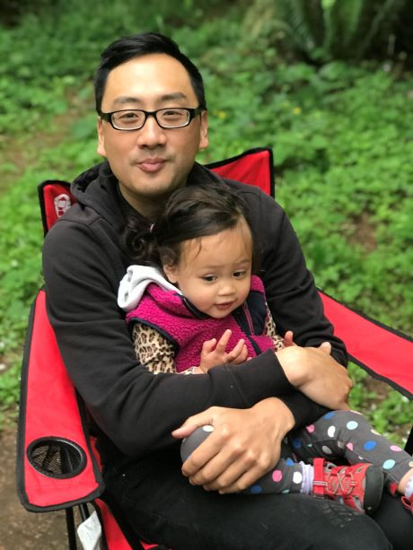
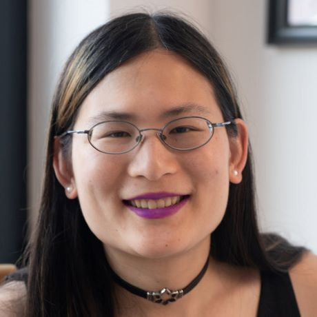
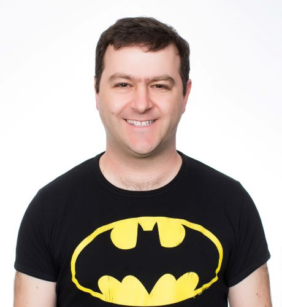
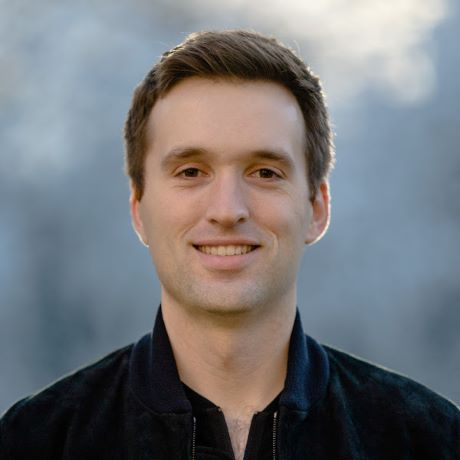
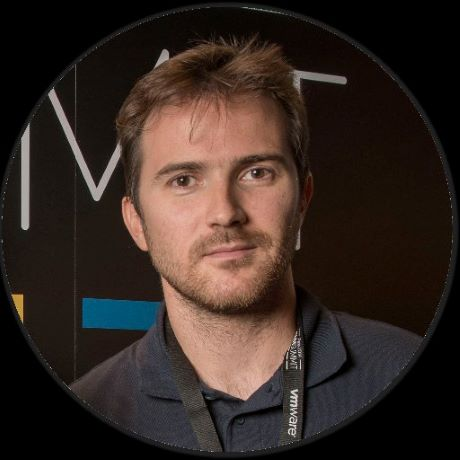
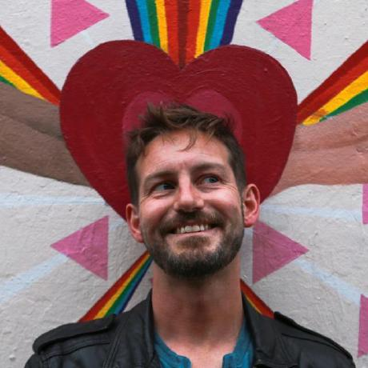

# 2019 OpenTelemetry Governance Committee Candidates

## List of candidates

In alphabetical order:

- [Alois Reitbauer](#Alois-Reitbauer)
- [Constance Caramanolis](#Constance-Caramanolis)
- [Daniel Prata Almeida](#Daniel-Prata-Almeida)
- [Edward Muller](#Edward-Muller)
- [Ilan Rabinovitch](#Ilan-Rabinovitch)
- [Kevin Chu](#Kevin-Chu)
- [Liz Fong-Jones](#Liz-Fong-Jones)
- [Luis Mineiro](#Luis-Mineiro)
- [Mark Carter](#Mark-Carter)
- [Morgan James McLean](#Morgan-James-McLean)
- [Steven Le Roux](#Steven-Le-Roux)
- [Ted Young](#Ted-Young)

---

### Alois Reitbauer

- Company: Dynatrace
- GitHub: [aloisreitbauer](https://github.com/aloisreitbauer)

Alois is Chief Technology Strategist at Dynatrace software. He has been building
successful infrastructure and monitoring software for the most part of his
career. Alois is the co-chair of the W3C Web Performance working group and
co-chair of the CNCF application deliver sig (which will also closely work with
the opentelemetry team). He also leads the open source initiatives at Dynatrace
and is a regular conference speaker, blogger and author.

---

### Constance Caramanolis

- Company: Splunk / Omnition
- GitHub: [ccaraman](https://github.com/ccaraman)

I am Senior Software engineer at Omnition, now Splunk, contributing to
OpenTelemetry and increasing adoption through tech talks. In 2020, I will be a
Kubecon Co-Chair. Prior to Omnition, I was at Lyft for 3 years maintaining,
operating and evangelizing Envoy. I presented over ten talks, including Kubecon
2018 Keynote, on utilizing and leveraging Envoy which led to close partnerships
with diverse engineers. Through my involvement in OpenTelemetry, I've
collaborated with companies to solve their various telemetry problems. This is
similar to what I did with Envoy. This consistent dialogue and interaction with
the community is what made it so strong. I want to bring the same philosophies
to OpenTelemetry and grow the community and project into the one we've all
invested so much in building.

---

### Daniel Prata Almeida

- Company: Spotify
- GitHub: [skateordie](https://github.com/skateordie)

I'm a Core Infrastructure product manager at Spotify, representing a major
organization of potential OpenTelemetry end-users/consumers. My team
(internally) provides metrics, tracing and logging solutions for thousands of
microservices while supporting engineers through their troubleshooting and
performance improvement experiences. I'd like to help the OpenTelemetry project
mature, graduate on CNCF and become a distinguished solution for high-quality
telemetry.

---

### Edward Muller

- Company: Salesforce / Heroku
- GitHub: [freeformz](https://github.com/freeformz)

Ed has been deeply involved in implementing and advocating for logging, metrics
and tracing solutions at Heroku for several years. He is currently involved in
work on the OpenTelemetry go client. He is one of the foremost experts on the go
language at Heroku, and is the primary author of the [Heroku Go buildpack](https://github.com/heroku/heroku-buildpack-go). He has
made contributions to both [golang](https://github.com/golang/go/commits?author=freeformz) and [go dep](https://github.com/golang/dep/commits?author=freeformz). Ed is involved in ongoing
telemetry projects at Heroku.

---

### Ilan Rabinovitch

- Company: Datadog
- GitHub: [irabinovitch](https://github.com/irabinovitch)

Ilan Rabinovitch leads the community and product teams at Datadog. He spends his
days diving into monitoring best practices, collaborating with Datadog's
open-source community and evangelizing observability best practices.

Most recently, he collaborated with the OTel governance and technical teams to
arrange the contribution of Datadog's tracing libraries to add and
auto-instrumentation support to OpenTelemetry. Prior to joining Datadog, Ilan
spent a number of years leading infrastructure and reliability engineering teams
at organizations such as Ooyala and Edmunds.com.

He's active in the wider open source and DevOps communities, including
co-founding events such as SCALE, Texas Linux Fest, and DevOpsDays LA.

---

### Kevin Chu

- Company: New Relic
- GitHub: [kbychu](https://github.com/kbychu)

Hello! I am a product manager at New Relic. New Relic is committed to engaging
the open source community and fostering the development of open standards in the
application performance monitoring space. OpenTelemetry is critical for
capturing the needed telemetry for observability platforms and I would love to
take part in contributing to the project.

---

### Liz Fong-Jones

- Company: Honeycomb
- GitHub: [lizthegrey](https://github.com/lizthegrey)

Liz is very involved in the OpenTelemetry community. She co-hosts the
OpenTelemetry Tuesdays on Twitch, and is a strong advocate for OpenTelemetry in
the broader dev community. Liz is excellent at thinking about the big picture
and would be a strong, positive force on the OpenTelemetry Governance Committee.
Liz has been collecting field feedback and bringing it back to the community and
is developing the OpenTelemetry workshop that will be given in early November at
Velocity, Berlin.

---

### Luis Mineiro

- Company: Zalando
- GitHub: [lmineiro](https://github.com/lmineiro)

I'm currently the Head of SRE at Zalando and have been working with
approximately 200 engineering teams increasing the observability and reliability
of the Zalando e-Commerce platform. Zalando is an enthusiastic adopter of many
CNCF technologies namely Kubernetes and OpenTracing. Zalando has been leveraging
tracing in new ways, namely improving the on-call health of the so-called
micro-service organizations
(<https://srecon19emea.sched.com/event/ScjD/are-we-all-on-the-same-page-lets-fix-that>).
I am personally very interested in contributing some time and effort to make
OpenTelemetry a success, not only for Zalando but for the many other similar
organizations out there.

---

### Mark Carter

- Company: AWS
- GitHub: [markcartertm](https://github.com/markcartertm)

Mark Carter is an entrepreneur, Software executive. Industry and open source thought leader.
In his 25 years career mark held senior engineering and product leadership
positions at Google, Microsoft, Amazon, Tesla and VMware among others.

Mark co-founded 3 successful startups and had led transformative projects in Big
Data, Distributed systems, IOT, Machine learning, Cloud, SRE & Observability.
Mark was the team lead for monitoring and logging at VMware and For all SRE
tooling for Google.

As an open source contributor and team lead, he launched, contributed to and
drove projects including ISTIO.io , FluentD, CollectD,  OpenMetrics, Prometheus
Stackdriver integration, Openstack and Grpc.

---

### Morgan James McLean

- Company: Google
- GitHub: [mtwo](https://github.com/mtwo)

Morgan has been the Product Manager for OpenCensus and OpenTelemetry at Google
since the very beginning. He led the pitch for OpenCensus inside Google, gained
partners like Microsoft, Etsy, and Omnition, and was responsible for the
definition and scoping of new functionality. Morgan made the initial merger
proposal for OpenTelemetry, worked with Pritam Shah, Ben Sigelman, and Sarah
Novotny to establish the seed committee and initial project scope, and hosts the
monthly community meetings. He regularly speaks about OpenTelemetry at
conferences, including the project announcement at Kubecon, and is also the
co-creator and committee chair of the W3C TraceContext specification.

---

### Steven Le Roux

- Company: OVHcloud
- GitHub: [StevenLeRoux](https://github.com/StevenLeRoux)

I work on the Time Series landscape since a while. My first contribution was an
intent for a exposition format from 2013
<https://github.com/StevenLeRoux/TimeSeries_Format_Specification>. I've directly
and indirectly worked on the Warp10 TSDB
<https://github.com/senx/warp10-platform/> and been in charge of observability
at OVH (a major european cloud provider) with few public contributions:

- blog post : <https://www.ovh.com/blog/monitoring-guidelines-for-ovh-observability/>
- <https://github.com/ovh/noderig>
- <https://github.com/ovh/beamium>

I think this journey can be resumed in these slides:
<https://fr.slideshare.net/StevenLeRoux1/metrics-spark-meetup>.  Lately we've
created TSL (Time Series Language) that we think could be the SQL for Time
Series (metrics, logs and tracing) and we would love to contribute it.
<https://github.com/ovh/tsl>.

OVH is a Cloud provider and my nomination would serve both the community for
useful and quality tools and APIs, and also I would represent the cloud provider
which aims to expose its products metrics in a standard exposition format to
ease adoption (Currently our product metrics are available via
Graphite/OpenTSDB/Warp10/Influx and PromQL APIs).

---

### Ted Young

- Company: LightStep
- GitHub: [tedsuo](https://github.com/tedsuo)

I’ve been part of the OpenTracing leadership team for the past 2.5 years. My
primary focus has been on API design, technical project management, and
facilitation. In fact, facilitating the merger of OpenCensus and OpenTracing is
one of my proudest accomplishments! I would like to join the OpenTelemetry
governance committee, as the position aligns well with the role that I currently
perform for the OpenTelemetry community.
