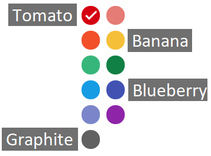

# How to create and configure meetings

In OpenTelemetry we are using CNCF zoom account. We currently own three
identical zoom rooms. A single room can only host one meeting at a time. So for
meeting differentiation in the calendar, beyond the location, colors are
associated with the rooms:

- "Banana" https://zoom.us/j/6729396170
- "Blueberry" https://zoom.us/j/8203130519
- "Tomato" https://zoom.us/j/8287234601

The color "Graphite" is used for non zoom meetings.

.

Same color (meeting location) meetings must not be held at the same time or be
back to back meetings.

All rooms are configured the same way. Some notes on meetings configuration:

- **Host is not required** to join the meeting. Anybody can join the meeting.
- **There is no time limit on the length of the meeting**. Please make sure nobody is
  using this room for another meeting on the calendar when meeting is going long
  over time.
- **Auto-recording is enabled for all rooms**. All OpenTelemetry public meetings are being recorded automatically. Find recordings at [YouTube](https://www.youtube.com/channel/UCHZDBZTIfdy94xMjMKz-_MA).

Every meeting must contain a link to the meeting notes. The meeting notes
document must be shared with write or commenting permissions.

Anyone can request to be added or removed as a meeting participant. Request can
be made via GitHub issue on this repository or contacting SIG maintainer via
other channels like Gitter.

All meetings must include [OpenTelemetry Calendar Invites Google Group](https://groups.google.com/g/opentelemetry-calendar)
as a participant. Anybody who wants to recieve up to date invites for all OpenTelemetry
meetings can join the group.

All SIG maintainers have permission to edit the Public OpenTelemetry calendar.
To get access to the calendar, please join the Google Group opentelemetry-calendar-contributors@googlegroups.com.
If your identity is not recognizable from the e-mail you are using to request joining the group, please
request to be added to this Google Group by creating an issue in this repository.

Important: all members of this Google Group has access to [zoom meetings host keys](https://docs.google.com/document/d/1gt9ctxKGPrM_XTINqLgkSxYypdrczHkt2znjwgBU4UU/edit#).
Please keep the membership of this group up to date and accurate.

## Zoom bombing

All members of opentelemetry-calendar-contributors@googlegroups.com has access to [the document](https://docs.google.com/document/d/1gt9ctxKGPrM_XTINqLgkSxYypdrczHkt2znjwgBU4UU/edit#)
explaining how to deal with inappropriate behavior in Zoom.
