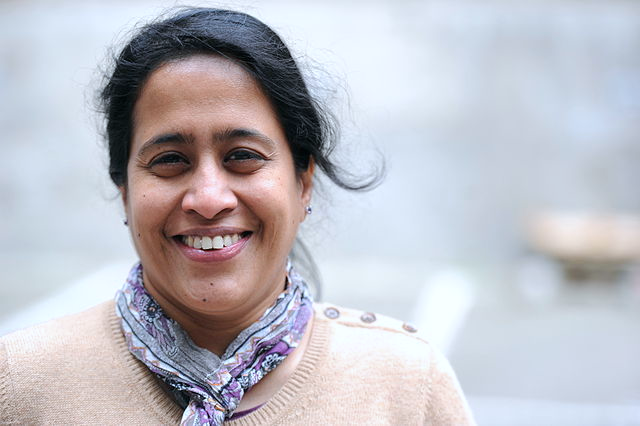
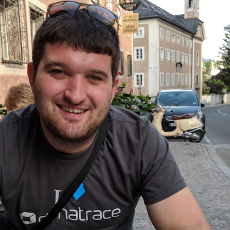
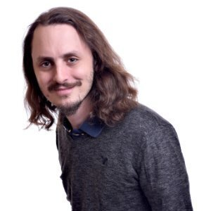
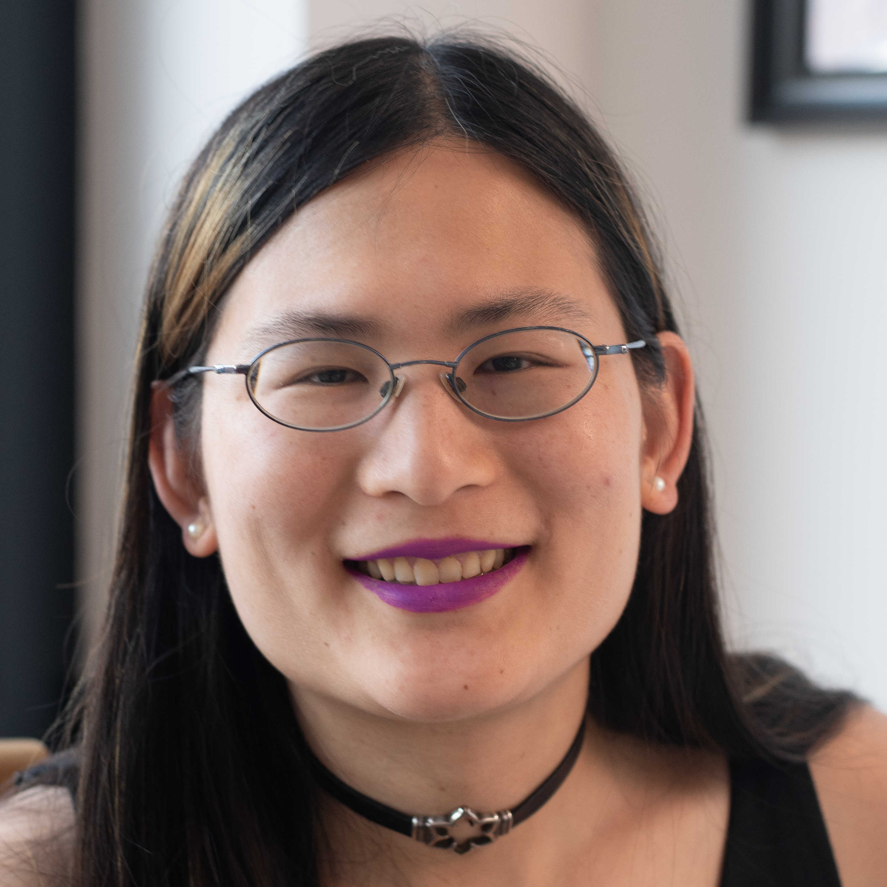
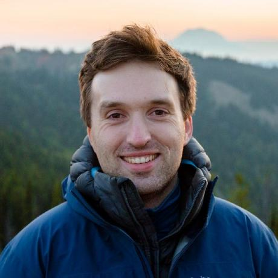
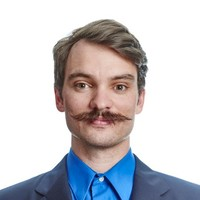

# 2020 OpenTelemetry Governance Committee Candidates

## List of candidates

In alphabetical order:

- [2020 OpenTelemetry Governance Committee Candidates](#2020-opentelemetry-governance-committee-candidates)
  - [List of candidates](#list-of-candidates)
    - [Alolita Sharma](#alolita-sharma)
    - [Daniel Dyla](#daniel-dyla)
    - [Ilan Rabinovitch](#ilan-rabinovitch)
    - [Liz Fong-Jones](#liz-fong-jones)
    - [Morgan McLean](#morgan-mclean)
    - [Tyler Yahn (He/Him)](#tyler-yahn-hehim)

---

### Alolita Sharma

- Company: Amazon Web Services (AWS)
- GitHub: [alolita](https://github.com/alolita)

I am a [Principal Technologist](https://www.linkedin.com/in/alolita/) at AWS where I lead development of OpenTelemetry components focused on metrics and log based observability and where I collaborate with Microsoft, Google, LightStep, Splunk, RedHat and others. I [speak](https://alolitasharma.com/my-talks-and-presentations/) at open source conferences such as the Linux Foundation Open Source Summit, ATO, OSCON, FOSDEM and Unicode where I have addressed the challenges of building large scale open source projects, collaborating on open standards and accelerating technology innovation. I have been [Director of Engineering](https://www.mediawiki.org/wiki/User:Alolitas) at the Wikimedia Foundation and served as an Officer and [Board Member](https://en.wikipedia.org/wiki/Open_Source_Initiative) of the Open Source Initiative (OSI). I currently serve as a [Board Director](https://unicode.org/consortium/directors.html) of the Unicode Consortium. At Wikimedia, I increased the ease-of-use and accessibility of Wikipedia by adding multilingual editing and internationalization tools. At the OSI, I helped reduce open source license proliferation and created the OSI education outreach program. At the Unicode Consortium, I am serving on the Governance and Infrastructure Committees to help create the 2020-21 operating plan. I also contribute to the Unicode Technical Committee and W3C on language standardization. I have designed and implemented governance policies and processes for a variety of open source projects including those at Wikimedia, OSI and AWS. Enhancing accessibility, expanding standardization, encouraging education outreach and facilitating broad collaboration are vital for the success of OpenTelemetry. As a Governance Committee member, I would like to use the lessons I have learned to benefit the OpenTelemetry project and help unlock the full potential of open source observability.

---

### Daniel Dyla

- Company: Dynatrace
- GitHub: [dyladan](https://github.com/dyladan)

Daniel is an Open Source Architect at Dynatrace where he works on OpenTelemetry and related topics. He is a maintainer of the OpenTelemetry JS SIG and a contributor to the specification, as well as a regular specification meeting attendee. He is a member of the W3C Distributed Tracing Working Group where he works on the Trace Context and Baggage standards. Daniel has spoken at [Observe 2020](https://observe2020.io/) and participated as a panelist discussing observability and how it drives value for teams and customers. As a governance committee member, Daniel is interested in leveraging his experience and enthusiasm to drive the OpenTelemetry project forward and ensure it is a safe, inclusive, and rewarding experience for contributors, maintainers, and users.

---

### Ilan Rabinovitch

- Company: Datadog
- GitHub: [@irabinovitch](https://github.com/irabinovitch)

Ilan Rabinovitch leads the community and product teams at Datadog. He spends his days diving into monitoring best practices, collaborating with Datadog's open source community and evangelizing observability best practices. Over the last year, he has collaborated with the OTel governance board and SIGs to arrange the contribution of Datadog's tracing libraries and auto-instrumentation support to OpenTelemetry. Prior to joining Datadog, Ilan spent a number of years leading infrastructure and reliability engineering teams at organizations such as Ooyala and Edmunds.com. He's active in the wider open source and DevOps communities, including co-founding events such as SCALE, Texas Linux Fest, and various DevOpsDays events.

---

### Liz Fong-Jones

- Company: Honeycomb.io
- GitHub: [lizthegrey](https://github.com/lizthegrey)

Liz is Principal Developer Advocate at honeycomb.io, and previously worked at
Google as a Staff Developer Advocate & Site Reliability Engineer. She's spent
her career helping engineers improve the operability and observability of
their systems. She is an approver for the OpenTelemetry Go SIG, wrote vendor
exporters for Go and Python, and has contributed to the OpenTelemetry
Collector. She has co-authored training & workshops to encourage OpenTelemetry
adoption, and presented on OpenTelemetry's behalf at KubeCon/CloudNativeCon
2019. She co-hosts the biweekly OpenTelemetry Tuesdays livestreamed podcast.

She has served an initial one-year term on the OpenTelemetry Governance
Committee and is standing for re-election.

---

### Morgan McLean

- Company: Google
- GitHub: [mtwo](https://github.com/mtwo)

Morgan is one of the co-founders of OpenTelemetry and currently serves on the
Governance Committee. His accomplishments in the open source observability space include:

- Co-creating OpenCensus at Google, defining its roadmap and release to customers, and growing the community
- Orchestrating the merger of OpenCensus and OpenTracing into OpenTelemetry, defining the OpenTelemetry governance structure, etc.
- Drafting the HTTP header specification that became W3C Trace Context, which he co-chairs
- Organizing OpenTelemetry's beta, release candidate, and GA requirements, driving towards these releases, and shipping them
- Speaking at the Kubecon and Next keynotes, and presenting OpenTelemetry in sessions at Kubecon, Next, Velocity, Monitorama, Perform, etc.
- Growing the community and bringing in new partners like Microsoft, Dynatrace, etc.

At Google, Morgan is responsible for all data ingestion into the Cloud Operations suite,
APM tools, and the VM logging experience.
Morgan's past roles include developing and operating high-scale services at Microsoft and
developing high-performance client code at Microsoft and BioWare.

---

### Tyler Yahn (He/Him)

- Company: New Relic
- GitHub: [@MrAlias](https://github.com/MrAlias)

Tyler has been an active contributor to the OpenTelemetry project for almost a
full year. During that time Tyler has served as an Approver and then a Maintainer
of the OpenTelemetry Go SIG and actively participated in the Specification SIG
including taking on the role of a Metrics Approver. As OpenTelemetry moves into
the future it has the potential to greatly help the technology community at large.
Tyler is excited to help cultivate and promote the growth of the OpenTelemetry
community and help ensure its success.
