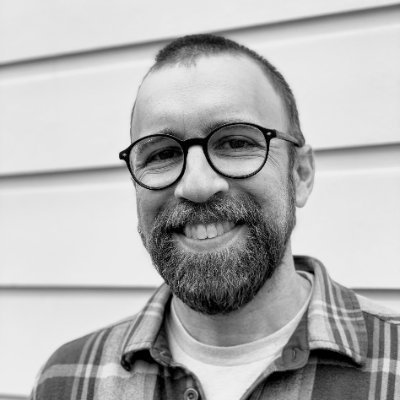
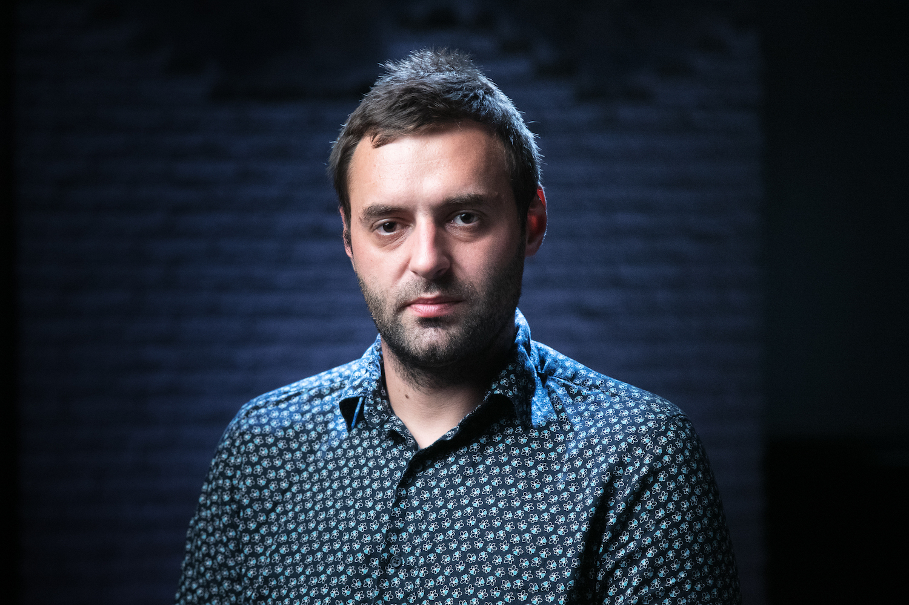
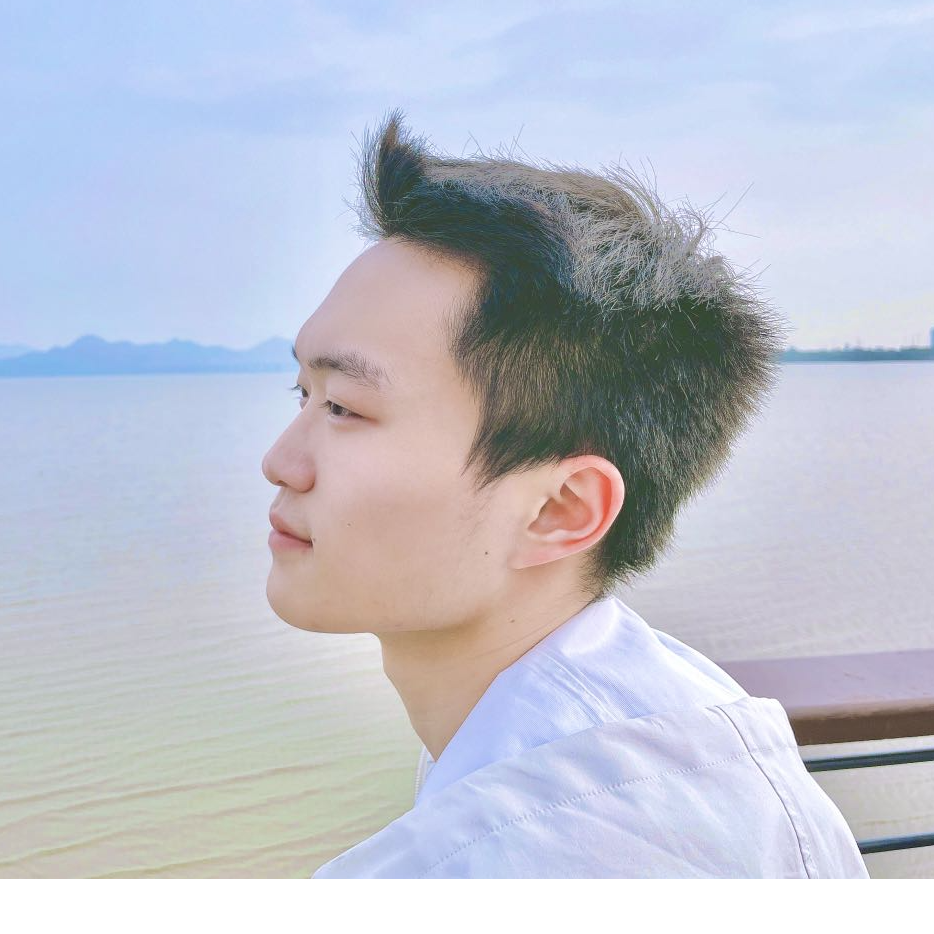
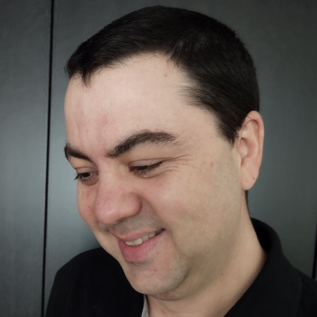
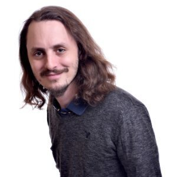
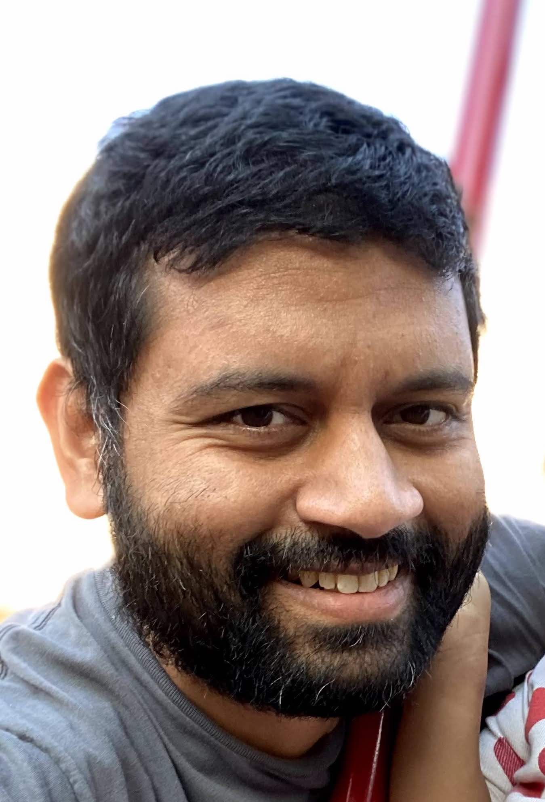
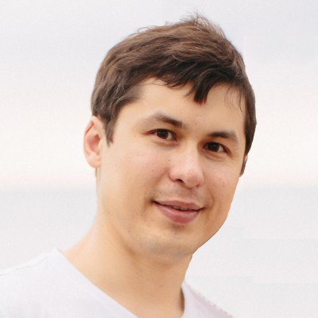
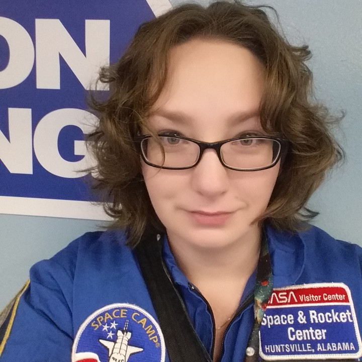
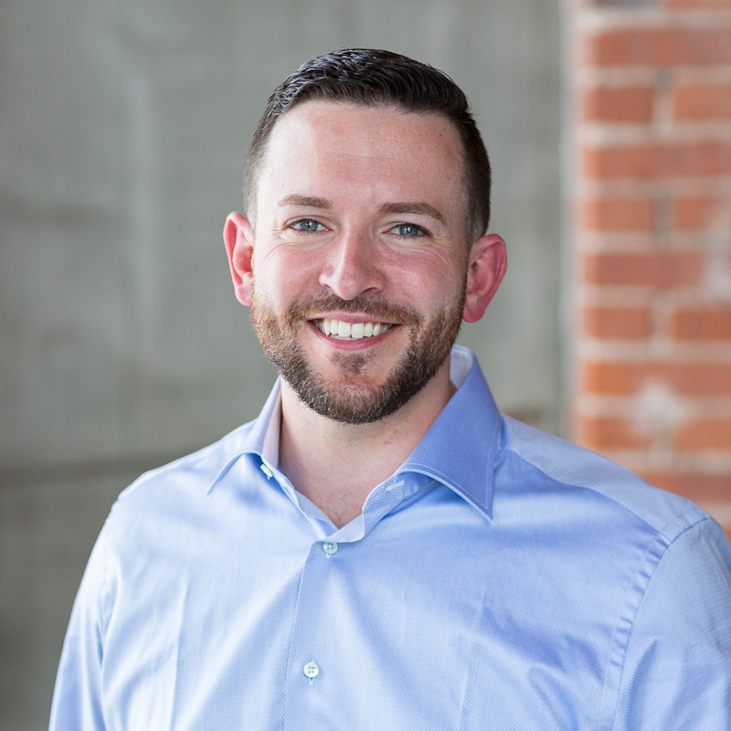
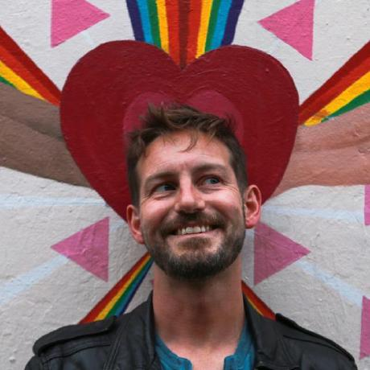

# 2021 OpenTelemetry Governance Committee Candidates

## List of candidates

In alphabetical order:

- [Ben Sigelman](#Ben-Sigelman)
- [Bogdan Drutu](#Bogdan-Drutu)
- [Csuzhang Cheung](#Csuzhang-Cheung)
- [Juraci Paixão Kröhling](#Juraci-Paix%C3%A3o-Kr%C3%B6hling)
- [Ilan Rabinovitch](#Ilan-Rabinovitch)
- [Punya Biswal](#Punya-Biswal)
- [Sergey Kanzhelev](#Sergey-Kanzhelev)
- [Sharr Creeden](#Sharr-Creeden)
- [Steve Flanders](#Steve-Flanders)
- [Ted Young](#Ted-Young)
- [Yuri Shkuro](#Yuri-Shkuro)

---
<!--

### Candidate 1

- Company: Company Name
- GitHub: [username](https://github.com/username)

Description of candidate

-->

### Ben Sigelman

- Company: Lightstep
- Github: [bhs](https://github.com/bhs)

Hi all! OpenTelemetry's mission is a very important one for our industry, and
as such I would be honored to continue to serve on the OTel Governance
Committee. Here I'll try to briefly summarize my history in the space as well
as my priorities for OpenTelemetry over the coming years.

**My history in the space:**

- Google days (2003-2012)
  - Productionized Dapper and published ["The Dapper Paper"](https://research.google/pubs/pub36356/)
    (trivia fact: I
    [coined the term "Span"](https://lightstep.com/blog/a-brief-history-of-the-span-hard-to-love-hard-to-kill/)
    in 2006, for better or worse!)
  - Co-created and productionized [Monarch](https://www.vldb.org/pvldb/vol13/p3181-adams.pdf)
- Lightstep days (2015-present)
  - While at a tracing workshop (along with [Yuri](#Yuri-Shkuro) below), a few
    of us started collaborating and soon co-created
    [OpenTracing](https://opentracing.io/), one of OpenTelemetry's two "parent"
    projects.
  - I worked hard to rebuild trust between OpenTracing and OpenCensus in 2018
    and 2019 in order to make OpenTelemetry possible – big kudos to everyone
    involved in that process, it was certainly a group effort!
  - I have been a tireless advocate for OpenTracing and now OpenTelemetry, even
    during the early days when everyone from incumbent vendors to Gartner told
    us we were all completely out to lunch. :) What we're all doing here is
    important and greatly beneficial but does require a lot of explanation and
    market education.

**My priorities for OpenTelemetry:**

If elected to another term, these are the things I would prioritize as a member
of the Governance Committee:
- *Greater involvement from OpenTelemetry end-users throughout the
  project:* from planning to prioritization to design iteration.
- *More detailed and more credible roadmaps:* OpenTelemetry is at risk of
  becoming a victim of its own success, with thousands of contributors and many
  constituents with broad priorities. We will benefit from additional planning
  upfront to get alignment on scope and timelines to guide the (excellent) work
  taking place across the project.
- *Scaling our processes and internal structures:* Our maintainers are
  *amazing* yet likely to burn out given the workload. Our contributors are
  also *amazing* yet often frustrated by lengthy delays and other side-effects
  of our scale. By creating more scalable structures and delegation within
  OTel, as a project we will be able to parallelize more effectively while
  helping to mentor the next crop of OTel leaders in the process.
- *Prioritize diversity:* OpenTelemetry is an "average" OSS project from a
  diversity and inclusion standpoint (and the average is not good!). I have
  advocated about this in numerous GC meetings in the past, and with the
  project rounding the bend on maturity I believe it is time to put more
  concerted effort into drawing people with diverse backgrounds into the
  project, at all levels.

---

### Bogdan Drutu

- Company: Splunk
- Github: [bogdandrutu](https://github.com/bogdandrutu)

Hi all! I am one of the OpenTelemetry's co-founder, one of the top contributor
to the overall project, a member of the Technical Committee, and one of the
initial members of the steering committee, and as such I would be honored to
continue to serve on the OTel Governance Committee.

**Prior work in the space:**

I've been active in the telemetry space for more than 10y:

- Google (2012-2019):
  - Founder of the OpenCensus project, which was one of the OpenTelemetry parent
  projects.
  - I've been one of the tech-leads for Google's internal Census project
  (predecessor of OpenCensus).
  - I've been deeply involved in making Google’s internal tracing project (Dapper)
  more successful and easier to access for everyone.
- Splunk (2019-2020):
  - I am one of the tech-leads of Observability “Getting Data In” team, which focuses
  on using OpenTelemetry to design the Splunk’s telemetry collection future.
- OpenTelemetry (since inception):
  - Member of the Technical Committee, proposed/reviewed a large part of the
  specifications.
  - I am an active maintainer of the OpenTelemetry collector.
  - I actively maintained the OpenTelemetry Java project until the 1.0 release.
- W3C:
  - Co-author of the initial [trace-context](https://www.w3.org/TR/trace-context/) specification.

**My priorities for OpenTelemetry:**

If elected for another term, I would continue to mediate the collaboration between GC
and TC, and continue to represent the engineers' interests in the Governance Committee.

---

### Csuzhang Cheung

- Company: [Tencent](https://github.com/tencent)
- Github: [zhyChesterCheung](https://github.com/zhyChesterCheung)

Hi! I'm an engineer at Tencent's internal observability team, which has made a huge
contribution to the OpenTelemetry community. At the same time, I participated in and
actively contributed to the OpenTelemetry community, especially the Go-SDK field in 
the past year. I have been active in the observability field for several years, and
have made various contributions to OpenTelemetry, Thanos, Prometheus and other communities. 
I am very proud to be a member of the OpenTelemetry community, thank you for considering 
me and voting for me!

**As a member of the governing board, my focus points will be:**

- Ensure that our decisions continue to be in line with the interests of the wider 
  Open-Source observability ecosystem, as well as create a more viable observability ecosystem.
  
- Promote the influence of observability in various countries, especially in Asia, and attract
  people of all levels and different backgrounds to join the project together.

---

### Juraci Paixão Kröhling

- Company: [Grafana Labs](https://grafana.com)
- GitHub: [jpkrohling](https://github.com/jpkrohling)

Hello! My name is Juraci Paixão Kröhling. I'm a passionate open source software engineer. I worked at Red Hat until I recently joined Grafana Labs to help build out a team focused on OpenTelemetry. Being able to contribute to OpenTelemetry during work time means that I will be able to dedicate the time a seat on the Governing Board deserves.

I have been a maintainer on the [Jaeger project](https://www.jaegertracing.io/) since 2018, contributing to OpenTelemetry since 2019, and a formal OpenTelemetry member since 2020. Within OpenTelemetry, I have been active in the following sub-projects:
- [Operator](https://github.com/open-telemetry/opentelemetry-operator), Creator and Maintainer, since 2019
- [Collector Builder](https://github.com/open-telemetry/opentelemetry-collector-builder), Creator and Maintainer, since 2021
- [Collector Contrib](https://github.com/open-telemetry/opentelemetry-collector-contrib), Approver, since 2020
- [Collector core](https://github.com/open-telemetry/opentelemetry-collector), Approver, since 2020

I'm proud to be among the top contributors to [OpenTelemetry overall](https://opentelemetry.devstats.cncf.io/d/9/developer-activity-counts-by-repository-group-table?orgId=1&var-period_name=Last%20year&var-metric=contributions&var-repogroup_name=All&var-country_name=All). Besides code and other technical work, my contributions include outreach. For a detailed list, please look through my [public talks](https://speakerhub.com/speaker/juraci-paixao-krohling) on topics like distributed tracing and OpenTelemetry at conferences such as [KubeCon](https://sched.co/lV0z), [OpenSource Summit](https://sched.co/FxW3), [FOSDEM](https://archive.fosdem.org/2020/schedule/event/tracing_beginners), and [Devoxx](https://www.youtube.com/watch?v=FJ_YuUgIt8E).  I care deeply about diversity, and have served as a mentor and coordinator for [Outreachy](https://www.outreachy.org) internships as part of the [“CNCF Tracing”](https://www.outreachy.org/communities/cfp/cncf-tracing/) community, an umbrella project that includes Jaeger and OpenTelemetry.

As a member of the governing board, my focus points will be:
- Community: Ensure that our decisions continue to be compatible with the interests of the broader open source observability ecosystem, including users, developers, projects, and vendors
- Diversity: Create new and strengthen existing diversity initiatives, like Outreachy, across OpenTelemetry's SIGs and projects. As a measurable goal, I intend to support at least two projects per year so that they can participate in Outreachy

---

### Ilan Rabinovitch

- Company: Datadog
- GitHub: [@irabinovitch](https://github.com/irabinovitch)

Ilan Rabinovitch leads the community and product teams at Datadog. He spends his days diving into monitoring best practices, collaborating with Datadog's open source community and evangelizing observability best practices. Over the last year, he has collaborated with the OTel governance board and SIGs to arrange the contribution of Datadog's tracing libraries and auto-instrumentation support to OpenTelemetry. Prior to joining Datadog, Ilan spent a number of years leading infrastructure and reliability engineering teams at organizations such as Ooyala and Edmunds.com. He's active in the wider open source and DevOps communities, including co-founding events such as SCALE, Texas Linux Fest, and various DevOpsDays events.

---

### Punya Biswal

- Company: Google
- Github: [punya](https://github.com/punya)

I’ve participated in the OpenTelemetry community for the past year, especially the Go and Collector SIGs. In addition to writing code, I help clarify contentious designs and onboard new contributors. As a [triager](../../community-membership.md#triager) for the collector repository, I help our busy maintainers and contributors to use their time efficiently.

Before getting involved in telemetry, I led teams at small-to-midsize companies that were shipping products and figuring out observability for the first time. I’d like to use the perspective I gained from that experience to advocate for simple designs that are easy for newcomers and small teams to adopt.

If elected to the GC, I’ll work to measure and improve the experience of OTel contributors – for example, looking at how many contributors “give up” on proposals, how long it takes to merge a pull request, or how often our automated tests flake.

---

### Sergey Kanzhelev

- Company: Google
- GitHub: [SergeyKanzhelev](https://github.com/SergeyKanzhelev)

Hi all! I have a long history working on observability and monitoring tools and was involved into OpenCensus and OpenTelemetry projects from their inception. I'm a co-chair of the W3C Distributed Tracing Working Group, which has strong ties to OpenTelemetry. I'm also involved in Kubernetes community which gives me a good perspective on how a different project addresses challenges OpenTelemetry faces. It will be my privilege to continue serving on the Governance Committee.

I strongly believe that the project with such an ambitious mission as OpenTelemetry, with the diverse group of contributors and interested parties, can only succeed if we together will uphold the project values, grow the community, and help everybody in the community grow. This is why as a Governance Committee member my goals are to enable contributors, empower maintainers, keep community welcoming and fair.

---

### Sharr Creeden

- Company: New Relic
- GitHub: [sharrmander](https://github.com/sharrmander)

Hi! For the past year, my primary focus has been improving New Relic’s support for OpenTelemetry informed by partnering with early adopter end-users to plan their OTel based observability strategies. In this capacity, I have successfully championed for New Relic to provide dedicated resources to the project and now I lead our growing OpenTelemetry community team composed of members, approvers, maintainers, and a developer advocate. By establishing this team, I’ve helped grow the OpenTelemetry community too.

I’ve been following the project closely and am inspired by the passion of the contributors and the potential of achieving OpenTelemetry’s mission. I want to contribute to making our shared vision a reality through my unique perspective, cultivated through a career building skills in the business and leadership sides of tech. As a non-developer, I can bring a complementary, but distinctly different background and perspective to the governance committee. I believe that through strong governance and supporting processes, we can build a sustainable community, amplify our advocacy efforts and polish the project to accelerate early majority adoption.

If elected to the governance committee I would prioritize:

- Interacting with members of the community and end-users to understand challenges and celebrate achievements.
- Creating and optimizing processes to improve feedback access and cycle time, especially as they pertain to stories from end-users and experiences of community contributors.
- Helping improve end-user engagement and accessibility of the project by contributing to efforts to improve roadmap visibility, reduce onboarding friction, and improve the example code and documentation.
- Collaborating with members of the governance committee on their platform priorities.

Thank you for your engagement - through both your project contributions and the voting process!

---

### Steve Flanders

- Company: Splunk (formerly Omnition)
- GitHub: [flands](https://github.com/flands)

Hi! I'm an [Engineering Director](https://www.linkedin.com/in/steveflanders/)
at Splunk and lead the Observability “Getting Data In” team which contributes
extensively to OpenTelemetry. I have been in the monitoring/observability space
for over a decade and involved in both the OpenCensus and OpenTelemetry
projects from the beginning. I am proud to be part of the incredible
OpenTelemetry community and appreciate your consideration and vote!

#### How I contribute

I helped co-create the OpenCensus Sevice and OpenTelemetry Collector with
involvement from software development and architecture to product management
and roadmap. Across many OpenTelemetry repositories I spend a lot of time on
getting started, documentation, and examples. I also help promote and teach
people about OpenTelemetry via conference talks, workshops, and blog posts. I
authored the [OpenTelemetry incubation
document](https://docs.google.com/document/d/1f4WQR6K84giyOCKjCsqcoVA8YUIzBhWZDVo3CwM1wuk/edit#heading=h.wrbwe8x26bft)
and presented it to TAG Observability.

#### My Values

- Community, diversity, and positivity; recognize and appreciate everyone
- Listen, share, learn, grow, and laugh; focus on openness and collaboration
- Prioritize ease of use and customer experience always

#### Why I'm Running

- Continue to build a positive community where opinions are heard and valued
- Help prioritize and drive customer adoption and case studies
- Ensure the best documentation with getting started guides and demos

---

### Ted Young

- Company: Lightstep
- GitHub: [tedsuo](https://github.com/tedsuo)

Hello, I'm one of the OpenTelemetry co-founders . My primary focus has been on
API design, technical project management, and facilitation. For every new project within OpenTelemetry,
my ethos has been to reach out to find new collaborators, give them the support that they need and
set them up for success. When a project is stuck on design, or is missing a designer, then I will also
bottom line the design work.

Examples include the many aspects of the tracing system, context propagation, error reporting, and our
approach to stability/backwards compatibility. Currently, I am focused on the design of semantic conventions
and instrumentation, ensuring that OpenTelemetry consistently produces the highest quality telemetry data
available.

I also facilitate conflict resolution, and I am available to all community members whenever they are experiencing
any difficulty or frustration. In general, I try to keep OpenTelemetry a friendly, drama-free environment
where collaboration is easy.

I've been a member of the OpenTelemetry governance committee for the past two years. This position aligns
well with the facilitation role that I currently perform for the OpenTelemetry community. If my approach to
community management sounds good to you, please vote for me so that I may continue facilitating and growing
our amazing community!

---

### Yuri Shkuro

- Company: Facebook
- GitHub: [yurishkuro](https://github.com/yurishkuro)

Hello. I am one of the co-founders of OpenTelemetry, a member of the original “seed” Governance Committee that was formed by merging OpenTracing and OpenCensus, and a member of OTel Technical Committee. I helped create many of the OTel’s charters and policies. My primary focus is on OTel Specification as a blueprint for developing APIs and SDKs. I am also the founder of the CNCF Jaeger project.

It will be my privilege to continue serving on the Governance Committee. There are several reasons why my candidacy brings unique perspective to the committee:

- I was a co-founder of the OpenTracing project (which is being retired), and I care about OTel continuing to serve the large number of users and companies who previously invested in OpenTracing.
- During the existence of OTel GC, I’ve been the only member who represented an end-user organization rather than a commercial observability/cloud vendor. I think we could use more end-user voices in the project’s leadership.
- I also represent OTel’s partner project Jaeger. Jaeger was the first oss tracing system that embraced vendor-neutral approach to instrumentation via OpenTracing, by developing fully compliant SDKs in multiple languages that followed a single specification while providing novel features like centralized control plane and adaptive sampling. I am happy to see OTel reaching the maturity where we can retire Jaeger’s own SDKs and recommend people to switch to OTel.
- Lastly, specific to tracing domain, I work with one of the few tracing systems in the industry that is not based on span model (like OTel & Jaeger), but on a richer event-based model (cf. Canopy paper).  That, as well as our scale requirements, also gives me a unique perspective on the usability of OTel APIs.
