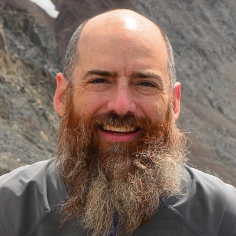

# 2022 OpenTelemetry Governance Committee Candidates

## List of candidates

In alphabetical order:

- [Alolita Sharma](#alolita-sharma)
- [Daniel Dyla](#daniel-dyla)
- [Ken Finnigan](#ken-finnigan)
- [Michael Hausenblas](#michael-hausenblas)
- [Morgan McLean](#morgan-mclean)
- [Pavol Loffay](#pavol-loffay)
- [Phillip Carter](#phillip-carter)
- [Reese Lee](#reese-lee)
- [Reiley Yang](#reiley-yang)
- [Sean Marciniak](#sean-marciniak)
- [Severin Neumann](#severin-neumann)
- [Trask Stalnaker](#trask-stalnaker)
- [Tyler Yahn](#tyler-yahn)
- [Vijay Samuel](#vijay-samuel)

<!--
### Candidate 1

- Company: Company Name
- GitHub: [username](https://github.com/username)
Description of candidate
---
-->

### Alolita Sharma

- Company: Apple
- GitHub: [alolita](https://github.com/alolita)
- Twitter: [alolita](https://twitter.com/alolita)
- Personal Website: [alolitasharma.com](https://alolitasharma.com/my-talks-and-presentations/)

Statement

I believe Open Telemetry (OTel) represents the future of open observability. It embodies standardization, interoperability and growing commitment by all key stakeholders in computing infrastructure and services. 

As a project contributor and member of the OTel governance committee, I will push for native support of OpenTelemetry in Kubernetes for all telemetry signals. I also will contribute to features important for wider adoption of OTel such as instrumentation, smart configuration management, real user monitoring, and profiling.

Some of my key accomplishments on OpenTelemetry over the last four years include: 
* I’ve helped the Collector project prioritize features for tracing and metrics stability, triaging issues, and maintaining GitHub project boards. 
* I added over 100 engineers, including women engineers, from multiple teams at AWS to contribute to the Collector and language libraries. 
* I helped OTel achieve incubation status by leading the graduation review process from sandbox to incubation with the CNCF TOC and the Observability TAG. 
* I’ve helped ensure maintainer diversity for the Collector, and language libraries including C++, Go, Java, JavaScript, .Net, PHP, and Python.
* I’ve actively mentored teams from companies like Cisco/AppDynamics, New Relic, and Atlassian to contribute to OTel.  
* I created the Prometheus-OpenMetrics-OpenTelemetry interoperability workgroup to deliver OTel metrics stability.
* I collaborated with the Prometheus project to codify the Prometheus remote-write (push) specification and compliance requirements.  
* I introduced OTel enhancement proposals (OTEPs) for real time monitoring (RUM) and Elastic Common Schema (ECS) logging. 
* I led the development of GitHub Actions CI/CD and security workflows for OTel’s language libraries. 

While at AWS, for more than three years I led observability strategy and engineering for OpenTelemetry and created “AWS Distro for OpenTelemetry” - an OTel infrastructure and services distribution. 

Today at Apple, I lead observability for Siri and other AI services. I’m a contributor to OTel and a member of the current OTel governance committee. I serve as co-chair of the CNCF Observability Technical Advisory Group (TAG) and also contribute to other open source observability projects including Prometheus, OpenMetrics, Cortex and Grafana. I’m passionate about open source collaboration, have contributed to several open source initiatives and have served on open source organization boards including OSI, SFLC.in and the Unicode Consortium. I’ve presented at international conferences including Kubecon, ApacheCon, Open Source Summit, TED and other venues.

So, now at Apple and running for a second term on the governance committee, I want to continue my contributions to the project and leverage the immense resources and reach of a key stakeholder, adopter and end-user.

I look forward to your vote so that we together can continue to create great progress in OpenTelemetry. 

Thank you for your support. 🙏  

---

### Daniel Dyla

- Company: Dynatrace
- GitHub: [dyladan](https://github.com/dyladan)

Daniel is a Senior Open Source Architect at Dynatrace where he works on OpenTelemetry
and related topics. He is seeking his second term as a Governance Committee member. He has
been a maintainer of the OpenTelemetry JS SIG for nearly 3 years, is a contributor
to the specification, and a regular attendee of specification SIG and collector
triage meetings. He is a member of the W3C Distributed Tracing Working Group where
he works on the Trace Context and Baggage standards. he has been a speaker and
panelist at multiple industry conferences and events such as Observe, KubeCon + CloudnativeCon,
OpenTelemetry Community Day, and others. As a governance committee member,
he has helped organize OpenTelemetry involvement in events like KubeCon and
OpenTelemetry Community Day. If elected for a second term, Daniel would focus on developer
experience, especially for developers new to OpenTelemetry and Open Source, as well
as continue to focus on making sure OpenTelemetry continues to be a safe, inclusive,
and rewarding experience for contributors, maintainers, and users.

---

### Ken Finnigan

- Company: [Workday](https://www.workday.com/)
- Github: [kenfinnigan](https://github.com/kenfinnigan)

Ken is the co-creator of Quarkus (https://quarkus.io/), a build time optimized framework for Kubernetes. He also helped drive the adoption of OpenTelemetry across Red Hat Middleware to ensure all projects/products can be efficiently observed with existing and new tooling. Achieving this with a clean developer experience by handling integration with frameworks directly.

Ken's role as Observability Architect at Workday is to drive innovation and adoption of technologies within his group with a goal to improve the developer experience of observability tooling. This covers everything from architecture and design of systems for logs, metrics, or traces, in public cloud, to working on improved methods for observing services, such as SLOs. Ken collaborates with teams across Workday to improve the developer experience from Platform engineering.

His nomination will bring a much needed balance to the board by being a voice representing end-users.

---

### Michael Hausenblas

- Company: [AWS](https://aws.amazon.com/)
- GitHub: [mhausenblas](https://github.com/mhausenblas)
- [Homepage](https://mhausenblas.info/)

Michael works in the AWS Open Source Observability service team where he's the Product Manager
looking after the AWS Distro for OpenTelemetry (ADOT). He has been contributing to OpenTelemetry
since late 2020 in various roles: as a CNCF Ambassador, as a TAG o11y member, working in the
end user domain (hosting end-user meetings and outreach), and through spreading the word about
OpenTelemetry throughs talks, for example at QCon. Michael is based out of Ireland and is
focusing on OpenTelemetry adoption, be that via tutorials or best practices.

---

### Morgan McLean

- Company: [Splunk](https://www.splunk.com/en_us/products/observability.html)
- GitHub: [mtwo](https://github.com/mtwo)

Morgan is one of the co-founders of OpenTelemetry, and currently serves on the governance committee. Morgan makes significant contributions directly OpenTelemetry:

- He runs the weekly maintainers check-in and participates in various SIGs, including client instrumentation, profiles, agent management, user feedback, etc.
- He organized and tracked the final drives towards the beta and GA releases of both traces and metrics
- He was instrumental in the creation of new signal types, specifically logs and profiles, and introduced new voices into the community to support these
- As part of the end-user working group, he solicits feedback from people who use OpenTelemetry and uses this to improve the project

Morgan’s work on the governance committee has focused on everything from moderating and participating in technical discussions, to community outreach and organizing the project’s presence at Kubecon, driving the project towards release milestones, and more. If re-elected, he plans to focus on reducing maintainer toil, more formally establishing the project roadmap, and driving the logs implementations to beta and GA.

At Splunk, Morgan is responsible for all platform functionality within Splunk Observability Cloud, which includes OpenTelemetry. He previously worked on high-scale observability systems at Google, where he co-created and grew OpenCensus, OpenTelemetry, and the W3C TraceContext specification, and brought partners like Microsoft and Dynatrace into these projects. Prior to that he developed and operated high-scale e-commerce systems at Microsoft and developed high-performance client code at Microsoft and BioWare.

---

### Pavol Loffay

- Company: [Red Hat](https://www.redhat.com/)
- Github: [pavolloffay](https://github.com/pavolloffay)

Pavol Loffay is a team lead of distributed tracing team at Red Hat. His team is responsible for OpenTelemetry and distributed tracing experience on OpenShift. The team is part of the larger observability organization that focuses on creating a unified observability experience on OpenShift based on the many CNCF projects - OpenTelemetry, Jaeger, Prometheus, and Thanos.

Pavol has been working in the open-source observability domain since 2015, here are some of his accomplishments:
* Co-creator and maintainer of [Hawkular APM](https://github.com/hawkular/hawkular-apm)
* [OpenTracing OTSC member](https://github.com/opentracing/specification/blob/master/project_organization.md#opentracing-specification-council-otsc)
* Maintainer of [Jaeger ecosystem](https://github.com/jaegertracing/jaeger#maintainers)
* Maintainer of [OpenTelemetry operator](https://github.com/open-telemetry/opentelemetry-operator#contributing-and-developing) and creator of the auto-instrumentation capabilities in the operator
* Emeritus approver of [OpenTelemetry Java auto-instrumentation](https://github.com/open-telemetry/opentelemetry-java-instrumentation/pull/2083)
* Emeritus approver of [OpenTelemetry Java API/SDK](https://github.com/open-telemetry/opentelemetry-java/pull/4089/files#diff-b335630551682c19a781afebcf4d07bf978fb1f8ac04c6bf87428ed5106870f5L215)
* Creator of [Hypetrace Javaagent](https://github.com/hypertrace/javaagent) - OpenTelemetry-based auto-instrumentation with extended data capture capabilities used for application security product. The requirements of this project helped to shape OpenTelemtry Java auto-instrumentation SPIs for vendor distributions.

Pavol works for a company that is fully committed to open-source and supporting the OpenTelemetry community.

If elected Pavol will focus on:
* Enhancing user experience, making OpenTelemetry easy to use
* Enhancing developer experience, especially for first-time contributors
* Making OpenTelemetry a successful community with rich data collection capabilities

Thank you for your support.

---

### Phillip Carter

- Company: [Honeycomb](https://www.honeycomb.io/)
- GitHub: [cartermp](https://github.com/cartermp)
- [Homepage](https://phillipcarter.dev/)

Phillip works for Honeycomb on the product team, where he works on improving OpenTelemetry
and a lot of other stuff. In his non-work time, he also contributes to OpenTelemetry, mainly
its documentation, and has recently become a maintainer of the Comminications SIG, which
encompasses the docs, blog, and website for OpenTelemetry.

Phillip is still relatively new to the Observability space, having worked on IDE tooling,
compilers, and language design at Microsoft for several years prior to joining Honeycomb.

If elected to the GC, Phillip will focus further on improving the overal developer experience
for all developers who use OpenTelemetry (and typically through its SDKs). This would primarily
be in the form of advocating for improving APIs to make common operations more convenient,
helping SIGs develop more opinionated best practices for using their technolog, and continuing
to help improve documentation for all of OpenTelemetry across the board.

---

### Reese Lee

- Company: [New Relic](https://newrelic.com/)
- GitHub: [reese-lee](https://github.com/reese-lee)

Hello! My name is Reese Lee, and I am a Developer Relations Engineer on the OpenTelemetry team at New Relic. Initially, I checked out a few different SIGs, but ultimately found that my primary area of interest lay in the End User Working Group – after all, what would this project be without end users? To that end, the majority of my contributions to this project thus far have been centered around end user enablement and engagement:

- Co-organizer for the [OpenTelemetry End User Discussion Group](https://opentelemetry.io/blog/2022/new-end-user-resources/#monthly-discussion-group)
- One of the primary contacts for the private #otel-endusers CNCF Slack channel (send me a message to be added!)
- Co-organizer for [OTel Unplugged Day](https://www.eventbrite.com/e/otel-unplugged-kubeconcloudnativecon-detroit-2022-tickets-427595037267), an event for the OpenTelemetry community taking place during KubeCon NA (P.S. Please attend!)
- Talks and blog posts on OpenTelemetry enablement:
  - [Tail-Based Sampling in the OpenTelemetry Collector](https://www.youtube.com/watch?v=l4PeclHKl7I) - KubeCon EU talk
  - [CNCF Live Webinar: OTel Me All About OpenTelemetry](https://community.cncf.io/events/details/cncf-cncf-online-programs-presents-cncf-live-webinar-otel-me-all-about-opentelemetry/)
  - [Tail Sampling with OpenTelemetry: Why it's useful, how to do it, and what to consider](https://opentelemetry.io/blog/2022/tail-sampling/) - OpenTelemetry.io blog post
  - [Where the Heck are my Spans: An OpenTelemetry Mystery](https://vi.to/hubs/o11yfest/videos/5088) - o11yFest talk
  - [Lightning Talk: OTel Me How to Build a Data Pipeline for Observability](https://sched.co/1Avqa) - Upcoming lightning talk at Open Observability Day, a co-located event for KubeCon NA 2022

If elected, my planned areas of action will pertain to:

- Increasing end user engagement, particularly among those newer to observability and development
- Improving end user enablement, in part by contributing more talks and blog posts myself as well as engaging others to do so
- Improving the end user experience as it relates to adoption, usage, and navigating the community and project

…with the end goal of ultimately increasing adoption and usage of OpenTelemetry, and thus improving the project and open source observability as a whole. 

---

### Reiley Yang

- Company: [Microsoft](https://www.microsoft.com/)
- GitHub: [reyang](https://github.com/reyang)

Hi, I am a member of the OpenTelemetry Technical Committee, emeritus maintainer
of OpenTelemetry C++ and Python, and approver of OpenTelemetry C++,
OpenTelemetry .NET and OpenTelemetry Demo.

I began to influence the telemetry industry since year 2017, as the maintainer
of OpenCensus Python and [was
acknowledged](https://www.w3.org/TR/trace-context/#acknowledgments) for the
contribution to the W3C TraceContext standard, including the design of the
widely used [test harness and
suite](https://github.com/w3c/trace-context/tree/main/test), which has been
adopted by many OpenTelemetry SIGs and vendors to validate their conformance to
the TraceContext specification.

Being one of the very initial members of OpenTelemetry, I helped to incubate and
unblock several projects:

- I was the initial maintainer who helped to kick off the OpenTelemetry Python
  SIG back in Jun. 2019. After the project started to run smoothly and reached
  beta, I stepped back as an emeritus maintainer.
- I started the OpenTelemetry C++ project as an initial maintainer back in Oct.
  2019, helped to ramp up the SIG, got the initial project set up, and attracted
  other developers from the community. I guided more than 10 developers and
  interns to deliver the metrics and logging prototype in 2020. I also sponsored
  two developers from Microsoft and eventually grew both of them to maintainers.
- I started to help the OpenTelemetry .NET project, after noticing it was
  blocked and has not seen breakthrough for almost a year. Starting from
  mid-2020, the project turned over and quickly reached Release Candidate in
  late 2020, followed by the 1.0 Stable release in early 2021. I remain active
  as an approver of the project.
- I helped to found the OpenTelemetry Demo workstream and turned it into a
  successful project.

As a Technical Committee member, I also oversee the project from the design,
specification and process perspective. Including defining the issue triage
process to unblock the trace and metrics release, facilitating the metrics
API/SDK specification stabilization, improving the workflow to unblock several
workstreams, encouraging the collaboration between OpenTelemetry community and
other open-source communities.

If elected, I would like to spend more energy on attracting talents, improving
our collaboration efficiency and helping members to grow so we can achieve more
as a community.

---

### Sean Marciniak

- Company: [Atlassian](https://www.atlassian.com/)
- Github: [MovieStoreGuy](https://github.com/MovieStoreGuy)

I've been work as part of the Observability team here at Atlassian for nearly four years and having been contributing back to OpenTelemetry to help progress internal Observability standards.
I've been a visonary by starting [profiling support otep](https://github.com/open-telemetry/oteps/issues/139), and now it is finally being adopt.
I would love to help shape how our end users would get their biggest value from it.
I keen to be the voice in APAC and helping companies improve Open Telemetry and their current observability by helping provide a voice for them.

---

### Severin Neumann

- Company: [Cisco AppDynamics](https://www.appdynamics.com)
- Github: [svrnm](https://github.com/svrnm)

My name is Severin Neumann and I am based out of Germany. I am a maintainer in
the Communication SIG (Website, Docs). I have been doing software development
for 20 years. I have been a pre-sales engineer in the APM space for 6 years,
before I started working as Product Manager with a focus on OpenTelemetry at
Cisco/AppDynamics. I feel that I have an unusual combination of customer
background, vendor support, open source passion, development experience,
sales and ability to execute.

**Why I am running**

OTel’s mission to **enable effective observability by making high-quality**,
**portable telemetry ubiquitous** is a bold undertaking that changed how users
get insights into their code. This change is accelerating and there are plenty
of opportunities and challenges ahead!

I believe that, what we need to seize those opportunities and to tackle
those challenges, are passionate contributors and enthusiastic end-users:
contributors make sure that OpenTelemetry flourishes and happy end-users spread
the word about it.

Being passionate about a happy community, my own mission so far is to improve
the ease of use of OpenTelemetry via my contributions
(e.g. by [writing documentation](https://github.com/open-telemetry/opentelemetry.io/issues?q=author%3Asvrnm))
and to encourage as many people as possible within Cisco to contribute to
the OpenTelemetry projects: [I support 60 individuals](https://opentelemetry.devstats.cncf.io/d/66/developer-activity-counts-by-companies?orgId=1&var-period_name=Last%20year&var-metric=contributions&var-repogroup_name=All&var-country_name=All&var-companies=Cisco)
on their journey to from their first issue/PR to being an active member
of the community.

I would be honored to be elected by you into the Governance Committee and
to expand my mission to the whole project. 

If elected, ...
- ... I want to stretch my support to the whole community and encourage new-comers
  everywhere to become and stay active members of the community.
- ... I want to continue to improve the ease of use of OpenTelemetry and with that
  make sure that new end-users have a great first experience with OpenTelemetry.
- ... I want to work with the members of the GC & TC to foster our community and
  support you to stay a passionate contributor and a happy end-users for the
  years to come.

---

### Trask Stalnaker

- Company: [Microsoft](https://www.microsoft.com/)
- GitHub: [trask](https://github.com/trask)

Hi! I have been in the observability/monitoring space for a decade+, the past three years as a maintainer of the
OpenTelemetry Java Instrumentation project, and before that as author and maintainer of an open source Java APM tool
[Glowroot](https://glowroot.org).

I have helped build the OpenTelemetry Java Instrumentation community into one that "is welcoming, supportive, and
inclusive, more than any other I've contributed to" ([@lmolkova](https://github.com/lmolkova)). It is also the
[most active repository](https://opentelemetry.devstats.cncf.io/d/1/activity-repository-groups?orgId=1&var-period=y&var-repogroups=All&from=now-5y&to=now)
outside of the Collector and Collector Contrib repositories.

As a member of the OpenTelemetry Governance Committee, I would like to shift my focus within the community for the next
two years to focus on the health across all repositories and their respective contributor communities.

I believe there is a lot we can learn from each other across repositories and I would like to focus on driving these
discussions to identify best practices and concrete actions we can take to improve experiences for everyone,
from first-time contributors to long-time maintainers.

And as [one of the most active](https://opentelemetry.devstats.cncf.io/d/9/developer-activity-counts-by-repository-group-table?orgId=1)
contributors to OpenTelemetry, I believe I have the time, commitment, and support from my employer to take this on.

Thanks :heart:

---

### Tyler Yahn

- Company: [Splunk](https://www.splunk.com/en_us/products/observability.html)
- GitHub: [MrAlias](https://github.com/MrAlias)

Hi all!
OpenTelemetry is in the process of transforming our industry.
It has been an privilege to help progress this work over the past three years of my involvement with the project, and it would be an honor to help further by serving on the OTel Governance Committee.

I have been a contributor and maintainer of the OpenTelemetry Go project for thee years.
During that time, I have ...

- Run weekly SIG meetings and help promote a welcoming and respectful community
- Managed and delivered project milestones, including the release of the stable tracing API and SDK
- Acted as a founding member of the metric specification and helped release it as stable specification
- Lead the start of the OpenTelemetry Go auto-instrumentation SIG

As a member of the OpenTelemetry Governance Committee I plan to prioritize:

- *Strengthening our communities:* we need to ensure we are supporting structures, policy, and practices that help long-time maintainers as well as first-time contributors. [As an active contributor](https://opentelemetry.devstats.cncf.io/d/9/developer-activity-counts-by-repository-group-table?orgId=1) to the project, I know first-hand how frustrating things can be. I also know many groups grown and solved these frustrations across the project. I plan to help facilitate the spread of these good ideas project wide and in doing so build up our communities.
- *Building user confidence:* OpenTelemetry has accomplish a lot! In the next leg of OTels journey, we need to inspire confidence in our users. I plan to work on formalizing and effectively communicating our project's roadmap to help inspire this confidence.

---

### Vijay Samuel

- Company: [eBay](https://www.ebay.com/)
- GitHub: [vjsamuel](https://github.com/vjsamuel)

Vijay has been a part of eBay's cloud team for the past 10 years (first job out of college) and has mostly worked on its observability platform.
As the architect of eBay's Observability platform, Vijay is helping drive adoption of Open Telemetry at eBay (which he will be speaking about at the [CNCF Observability Day 2022](https://sched.co/1Avqd) ).
He has made great strides in moving eBay towards cloud native observability and drove adoption of Elastic Beats at eBay while being the highest contributor to the project outside of Elastic.
Vijay implemented key features that are the backbone of Beats' Kubernetes observability. He is currently spearheading the migration of Observability agents to Open Telemetry Collector and his team actively
contributes to bridging gaps that were seen during the migration while contributing new features like Exemplar support to the collector. Vijay and his team are working hard to add value to the Open Telemetry Collector project.

Vijay has vast experience running a very highly scalable Observability platform built on top of Open Source projects. He is deeply passionate and truly believes in the spirit of Open Source. His nomination will bring a strong end user perspective
to the board and will better represent end users and the various pain points that they face.
