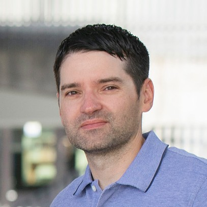

# 2023 OpenTelemetry Governance Committee Candidates

## List of candidates

In alphabetical order:

- [Candidate Name](#candidate-name)

<!--
### Candidate 1

- Company: Company Name
- GitHub: [username](https://github.com/username)
Description of candidate
---
-->

### Austin Parker

- Company: Embargoed until 2nd Week of October
- GitHub: [austinlparker](https://github.com/austinlparker)

Austin Parker is the Community Maintainer of OpenTelemetry and long-term
contributor. They have been involved in the project since inception, and have
been a consistent advocate, organizer, and contributor. Austin has been a
maintainer of the Communications and Demo SIGs, a co-chair and organizer of
Observability Day event at KubeCon EU and NA, has authored two books on
distributed tracing and OpenTelemetry, and is an overall swell person.

If elected, Austin will continue to work on community advocacy, outreach, and
contributor experience. OpenTelemetry is only as successful as it is because of
its community, and the GC's role is to nurture and guide that community. They
will prioritize efforts to increase the contributor and maintainer community
size, ensure that the project is welcoming and inclusive, and to guide the
project towards graduation and long-term success.

### Juraci Paixão Kröhling

- Company: Grafana Labs
- GitHub: [jpkrohling](https://github.com/jpkrohling)

I'm Juraci Paixão Kröhling, a passionate open-source software engineer, and I'm
seeking your support for my re-election to the OpenTelemetry Governing Board. My
commitment to the project runs deep and I have chosen an employer willing to
sponsor my upstream work full time. Since my election in 2021, I've actively
contributed to the OpenTelemetry project and the wider observability community.
Here are some concrete examples of what I've accomplished during my tenure
2021-2023:

* Established the joint GC/TC call as an avenue for communication between the
  two groups
* Helped make the project more popular by talking about it at podcasts,
  conferences, and other similar events
* Attended the first in-person OTel leadership summit, discussing current
  challenges to the project and what we can do to overcome them
* Mediated conflicts, with the goal of keeping the OTel community welcoming to
  new members
* Actively proposed, reviewed, and voted on changes to the project
* Coordinated the participation of the OpenTelemetry project in the
  [Outreachy](https://www.outreachy.org/) internship programs, successfully
  recruiting mentors among the OpenTelemetry maintainers
* Volunteered to be a sponsor for the SIG Security, taking an active
  participation there
* Connected people from different parts of the community based on the broader
  community view I obtained as being part of the board

As an engineer, I’m active in communities around the SIG Collector, where I’m an
[approver in the
core](https://github.com/open-telemetry/opentelemetry-collector#contributing)
repository, and [maintainer in the
contrib](https://github.com/open-telemetry/opentelemetry-collector-contrib/#contributing)
repository, being the author or code owner for several components, including the
[load-balancing
exporter](https://github.com/open-telemetry/opentelemetry-collector-contrib/tree/main/exporter/loadbalancingexporter#trace-idservice-name-aware-load-balancing-exporter)
and [tail-sampling
processor](https://github.com/open-telemetry/opentelemetry-collector-contrib/tree/main/processor/tailsamplingprocessor#tail-sampling-processor),
which together allow open-source users to achieve a scalable tail-sampling
deployment without getting locked-in with specific vendors. I’m also the creator
of the [OpenTelemetry Operator for
Kubernetes](https://github.com/open-telemetry/opentelemetry-operator), having
successfully fostered a community around it that is able to continue evolving
further even after I stepped back from maintainership to focus on other OTel
areas. Overall, I’m very proud of my contributions to the project, placing me
among the [top 10
contributors](https://opentelemetry.devstats.cncf.io/d/9/developer-activity-counts-by-repository-group-table?orgId=1&var-period_name=Last%202%20years&var-metric=contributions&var-repogroup_name=All&var-country_name=All)
to the project since the last election.

My commitment to the project and the wider observability community goes beyond
the technical contributions: I was part of the [Program Committee for
several](https://www.credly.com/users/juraci-paixao-krohling/badges) editions of
KubeCon, including North America (2023, 2022, 2021), Europe (2023, 2022, 2021),
and China (2020). I also participated as a speaker or panel member in events
like OTel Unplugged, Observability Day, KubeCon EU and NA, among others. As a
side project, I run [Dose de Telemetria](https://linktr.ee/dosedetelemetria),
where I produce quality and up-to-date content once a week about Observability
and Monitoring with a strong focus on OpenTelemetry in my native language,
Portuguese. Due to my community contributions I have been selected as a [CNCF
Ambassador](https://www.cncf.io/people/ambassadors/?_sft_lf-country=de&_sft_lf-expertise=technical&_sft_lf-project=opentelemetry&p=juraci-paixao-krohling)
in 2023.

If re-elected, I will continue to actively contribute, collaborate, foster
collaboration, and drive the project's success. Your vote will enable me to
further advance OpenTelemetry's mission and impact. Similar to last time, my
main focus will be on ensuring that our decisions continue to be compatible with
the interests of the broader open-source observability ecosystem, including
users, developers, projects, and vendors. In addition, I’ll continue
OpenTelemetry’s participation in Outreachy by recruiting maintainers to become
mentors of new interns. My goal is to participate in all Outreachy cohorts for
the next two years.

For your reference, my 2021 platform can be found
[here](https://github.com/open-telemetry/community/blob/main/elections/2021/governance-committee-candidates.md#Juraci-Paix%C3%A3o-Kr%C3%B6hling).

Thank you for your support in ensuring the continued growth and success of
OpenTelemetry.

### Eric Sirianni

- Company: [Confluent](https://confluent.io)
- GitHub: [sirianni](https://github.com/sirianni)

I'm Eric Sirianni, a technical leader at Confluent focused on Observability.

My team currently operates an OpenTelemetry-based platform that powers several
critical use cases within Confluent Cloud. We run a fleet of over 45,000
OpenTelemetry Collector agents in production, exporting telemetry to both
internal and third-party systems. Our internal metrics pipeline ingests over 6
million datapoints per-second with less than 2 minute lag and serves over 300
queries per-second with sub-second latency.

I introduced OpenTelemetry to Confluent's architecture in 2020 and have since
been evangelizing its adoption across our platform.  I also meet regularly with
our Observability vendors to suggest and advocate OpenTelemetry-related features
on their roadmaps.

Over the past few years, I have been a fairly active participant in the
OpenTelemetry community, primarily engaging in Slack discussions and submitting
bug reports or feature requests.  I've been very impressed with the enthusiasm
and welcoming nature of the OTel community, as well as their openness and
responsiveness to feedback.

If elected, I hope to provide an end user's perspective to the GC and share my
experiences as both an adopter and advocate for OpenTelemetry.