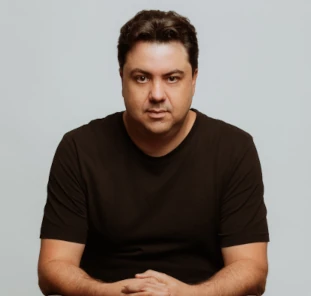

# 2023 OpenTelemetry Governance Committee Candidates

## List of candidates

In alphabetical order:

- [Candidate Name](#candidate-name)

<!--
### Candidate 1

- Company: Company Name
- GitHub: [username](https://github.com/username)
Description of candidate
---
-->

### Austin Parker

- Company: Embargoed until 2nd Week of October
- GitHub: [austinlparker](https://github.com/austinlparker)

Austin Parker is the Community Maintainer of OpenTelemetry and long-term
contributor. They have been involved in the project since inception, and have
been a consistent advocate, organizer, and contributor. Austin has been a
maintainer of the Communications and Demo SIGs, a co-chair and organizer of
Observability Day event at KubeCon EU and NA, has authored two books on
distributed tracing and OpenTelemetry, and is an overall swell person.

If elected, Austin will continue to work on community advocacy, outreach, and
contributor experience. OpenTelemetry is only as successful as it is because of
its community, and the GC's role is to nurture and guide that community. They
will prioritize efforts to increase the contributor and maintainer community
size, ensure that the project is welcoming and inclusive, and to guide the
project towards graduation and long-term success.

### Juraci Paixão Kröhling

- Company: Grafana Labs
- GitHub: [jpkrohling](https://github.com/jpkrohling)

I'm Juraci Paixão Kröhling, a passionate open-source software engineer, and I'm
seeking your support for my re-election to the OpenTelemetry Governing Board. My
commitment to the project runs deep and I have chosen an employer willing to
sponsor my upstream work full time. Since my election in 2021, I've actively
contributed to the OpenTelemetry project and the wider observability community.
Here are some concrete examples of what I've accomplished during my tenure
2021-2023:

* Established the joint GC/TC call as an avenue for communication between the
  two groups
* Helped make the project more popular by talking about it at podcasts,
  conferences, and other similar events
* Attended the first in-person OTel leadership summit, discussing current
  challenges to the project and what we can do to overcome them
* Mediated conflicts, with the goal of keeping the OTel community welcoming to
  new members
* Actively proposed, reviewed, and voted on changes to the project
* Coordinated the participation of the OpenTelemetry project in the
  [Outreachy](https://www.outreachy.org/) internship programs, successfully
  recruiting mentors among the OpenTelemetry maintainers
* Volunteered to be a sponsor for the SIG Security, taking an active
  participation there
* Connected people from different parts of the community based on the broader
  community view I obtained as being part of the board

As an engineer, I’m active in communities around the SIG Collector, where I’m an
[approver in the
core](https://github.com/open-telemetry/opentelemetry-collector#contributing)
repository, and [maintainer in the
contrib](https://github.com/open-telemetry/opentelemetry-collector-contrib/#contributing)
repository, being the author or code owner for several components, including the
[load-balancing
exporter](https://github.com/open-telemetry/opentelemetry-collector-contrib/tree/main/exporter/loadbalancingexporter#trace-idservice-name-aware-load-balancing-exporter)
and [tail-sampling
processor](https://github.com/open-telemetry/opentelemetry-collector-contrib/tree/main/processor/tailsamplingprocessor#tail-sampling-processor),
which together allow open-source users to achieve a scalable tail-sampling
deployment without getting locked-in with specific vendors. I’m also the creator
of the [OpenTelemetry Operator for
Kubernetes](https://github.com/open-telemetry/opentelemetry-operator), having
successfully fostered a community around it that is able to continue evolving
further even after I stepped back from maintainership to focus on other OTel
areas. Overall, I’m very proud of my contributions to the project, placing me
among the [top 10
contributors](https://opentelemetry.devstats.cncf.io/d/9/developer-activity-counts-by-repository-group-table?orgId=1&var-period_name=Last%202%20years&var-metric=contributions&var-repogroup_name=All&var-country_name=All)
to the project since the last election.

My commitment to the project and the wider observability community goes beyond
the technical contributions: I was part of the [Program Committee for
several](https://www.credly.com/users/juraci-paixao-krohling/badges) editions of
KubeCon, including North America (2023, 2022, 2021), Europe (2023, 2022, 2021),
and China (2020). I also participated as a speaker or panel member in events
like OTel Unplugged, Observability Day, KubeCon EU and NA, among others. As a
side project, I run [Dose de Telemetria](https://linktr.ee/dosedetelemetria),
where I produce quality and up-to-date content once a week about Observability
and Monitoring with a strong focus on OpenTelemetry in my native language,
Portuguese. Due to my community contributions I have been selected as a [CNCF
Ambassador](https://www.cncf.io/people/ambassadors/?_sft_lf-country=de&_sft_lf-expertise=technical&_sft_lf-project=opentelemetry&p=juraci-paixao-krohling)
in 2023.

If re-elected, I will continue to actively contribute, collaborate, foster
collaboration, and drive the project's success. Your vote will enable me to
further advance OpenTelemetry's mission and impact. Similar to last time, my
main focus will be on ensuring that our decisions continue to be compatible with
the interests of the broader open-source observability ecosystem, including
users, developers, projects, and vendors. In addition, I’ll continue
OpenTelemetry’s participation in Outreachy by recruiting maintainers to become
mentors of new interns. My goal is to participate in all Outreachy cohorts for
the next two years.

For your reference, my 2021 platform can be found
[here](https://github.com/open-telemetry/community/blob/main/elections/2021/governance-committee-candidates.md#Juraci-Paix%C3%A3o-Kr%C3%B6hling).

Thank you for your support in ensuring the continued growth and success of
OpenTelemetry.

### Eric Sirianni

- Company: [Confluent](https://confluent.io)
- GitHub: [sirianni](https://github.com/sirianni)

I'm Eric Sirianni, a technical leader at Confluent focused on Observability.

My team currently operates an OpenTelemetry-based platform that powers several
critical use cases within Confluent Cloud. We run a fleet of over 45,000
OpenTelemetry Collector agents in production, exporting telemetry to both
internal and third-party systems. Our internal metrics pipeline ingests over 6
million datapoints per-second with less than 2 minute lag and serves over 300
queries per-second with sub-second latency.

I introduced OpenTelemetry to Confluent's architecture in 2020 and have since
been evangelizing its adoption across our platform.  I also meet regularly with
our Observability vendors to suggest and advocate OpenTelemetry-related features
on their roadmaps.

Over the past few years, I have been a fairly active participant in the
OpenTelemetry community, primarily engaging in Slack discussions and submitting
bug reports or feature requests.  I've been very impressed with the enthusiasm
and welcoming nature of the OTel community, as well as their openness and
responsiveness to feedback.

If elected, I hope to provide an end user's perspective to the GC and share my
experiences as both an adopter and advocate for OpenTelemetry.

### Vijay Samuel

- Company: [eBay](https://www.ebay.com)
- GitHub: [vjsamuel](ttps://github.com/vjsamuel)

Vijay Samuel is a Principal MTS, Architect at eBay and helps lead its internal Observability platform. He has been involved
in the OpenTelemetry project for the last couple of years and has been a strong advocate for the project both within eBay
and externally. Vijay has given talks at [KubeCon](https://www.youtube.com/watch?v=tZJd6W-CIcU), 
done [panel discussions](https://www.youtube.com/watch?v=cypL2ZWUElE&t=9278s) and written 
technical [blogs](https://opentelemetry.io/blog/2022/why-and-how-ebay-pivoted-to-opentelemetry/) on the advantages of
adopting OpenTelemetry within large organizations such as eBay. Vijay is also the co-chair of TAG Observability's Query
Language Standardization working group. Vijay is passionate about Open Source and has contributed to various projects since the age
of 19.  He has a wealth of knowledge not only in being an adopter of OpenTelemetry but also in building out massive scale
Observability platforms. 

If elected Vijay will bring a much-needed end user perspective to the GC, provide representation to the various end users and
help the community understand their needs and requirements.

### Severin Neumann

- Company: [Cisco](https://www.cisco.com/)
- GitHub: [svrnm](https://github.com/svrnm)

#### What I'll Do

I have been a software engineer for over 20 years and [published much of my work as open source](https://github.com/svrnm/). Three years ago, [I started contributing to OpenTelemetry](https://github.com/open-telemetry/opentelemetry-js/pull/1509) and have since become a [co-maintainer of SIG Communications](https://github.com/open-telemetry/opentelemetry.io/issues?q=involves%3Asvrnm+sort%3Aupdated-desc). Along this journey, I have learned from best practices, made mistakes, and enjoyed interacting with the fantastic people in the OpenTelemetry community.

Each role in a contributor's journey is crucial to the success of OpenTelemetry and presents its own challenges. If elected to the Governance Committee, my goal, in collaboration with other community leaders such as the Governance Committee, Technical Committee, and maintainers, is to:

- **Lower the barrier for new contributors:** With my experience in leading OpenTelemetry efforts at Cisco, I have successfully encouraged [nearly 100 individuals](https://opentelemetry.devstats.cncf.io/d/66/developer-activity-counts-by-companies?orgId=1&var-period_name=Last%20decade&var-metric=contributions&var-repogroup_name=All&var-country_name=All&var-companies=Cisco) to make contributions. I have learned about the challenges they face and how to address them, such as providing precise guidelines and offering one-on-one assistance. I want to utilize this experience to make it easier for new contributors to get started and become long-term contributors. My goal is to work with the community to identify effective means of lowering the barrier for new contributors and implement them.

- **Help existing contributors advance:** We want and need first-time contributors to stay and become established members of the community. I believe that recognition for contributions plays a key role in retaining contributors. As the OpenTelemetry community grows rapidly, it becomes challenging to keep track of all the great work happening outside of repositories. My goal is to establish means to recognize and reward contributions at a community-wide level and support contributors on their journey to becoming approvers, maintainers, and leaders. This includes addressing the need to properly track and recognize contributions that may not be currently accounted for, such as giving talks, actively participating in SIG calls, or helping in the community forum.

- **Support maintainers:** Maintainers are the backbone of the OpenTelemetry community, often contributing in their spare time. To sustainably fulfill their role, maintainers need to be effective and face minimal friction. I believe that SIGs can learn from each other and share best practices to achieve this. My goal is to uncover these opportunities and provide SIGs with the support they need to be more effective and sustainable. Additionally, I will help to look beyond OpenTelemetry and learn from other successful OSS communities.

- **Drive interaction and integration with the wider OSS community:** It is part of [OpenTelemetry's mission](https://opentelemetry.io/community/mission/#telemetry-should-be-built-in) that _high-quality telemetry should be built in to the entire software stack – just like comments are today_. Therefore, it is crucial to actively engage with the wider OSS community and establish relationships with other projects. Strengthening existing relationships and establishing new ones will help us achieve our shared vision and mission. My goal is to drive the interaction and integration of OpenTelemetry with other OSS projects, to accomplish our shared vision and mission.

#### About Me

I am a co-maintainer of SIG Communication ([Website and Docs](https://github.com/open-telemetry/opentelemetry.io)) and focus on providing an easy entry to OpenTelemetry for end-users by leveraging the work of other SIGs. Currently, I am passionate about creating consistency in our documentation to improve maintainability and user experience. For example, I am driving the standardizing of ["Getting Started"](https://github.com/open-telemetry/opentelemetry.io/issues/2623) guides and sections about ["Manual Instrumentation"](https://github.com/open-telemetry/opentelemetry.io/issues/3229) across different languages.

At Cisco, I am a member of the [Open Source Program Office](https://opensource.cisco.com) and actively drive an internal community around OpenTelemetry. Over the past two years, this community has grown from a handful of individuals to almost 100 contributors, with [over 12,000 contributions and 900+ merged PRs](https://opentelemetry.devstats.cncf.io/d/5/companies-table?orgId=1).

I have also had the opportunity to speak about OpenTelemetry at [KubeCon EU](https://youtu.be/XvPsdjNrpKo?feature=shared) and at [CloudLand 2023 in Germany](https://en.shop.doag.org/events/cloudland/2023/agenda/#eventDay.all#textSearch.Severin%20Neumann) and participate in the [Program Committee for KubeCon NA](https://www.credly.com/badges/c930d2a0-b88d-4a7f-b4b8-a72d941)

#### Thank You 

Thank you for being part of the awesome OpenTelemetry community!
