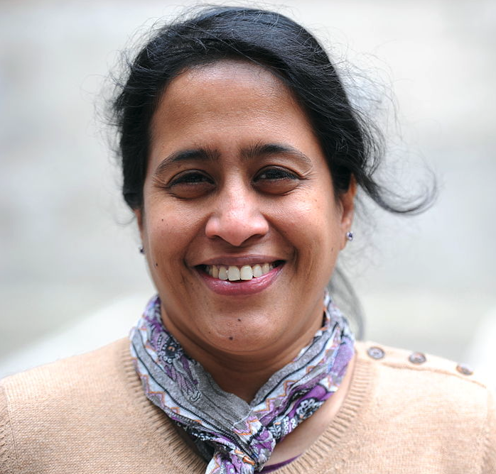
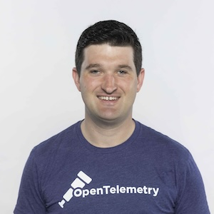
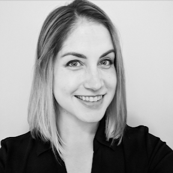
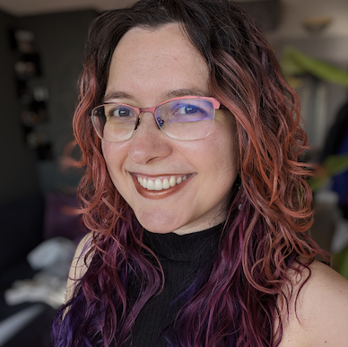
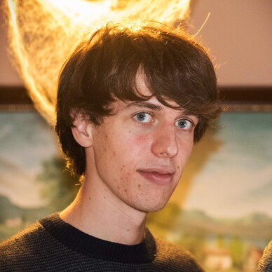
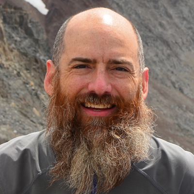

# 2024 OpenTelemetry Governance Committee Candidates

## List of candidates

In alphabetical order:

- [Adriana Villela](#adriana-villela)
- [Alolita Sharma](#alolita-sharma)
- [Daniel Dyla](#daniel-dyla)
- [Jamie Danielson](#jamie-danielson)
- [Marylia Gutierrez](#marylia-gutierrez)
- [Morgan McLean](#morgan-mclean)
- [Pablo Baeyens Fernández](#pablo-baeyens-fernández)
- [Trask Stalnaker](#trask-stalnaker)

---

### Adriana Villela

- Company: [ServiceNow](https://servicenow.com)
- GitHub: [avillela](https://github.com/avillela)

I'm Adriana Villela, and I have been involved with OpenTelemetry since 2022. I am one of the maintainers of the OTel End User SIG, and I am also a CNCF Ambassador. I have been an early proponent of OpenTelemetry, since my days of working as a manager of the Observability Practices team at Tucows, where I convinced the entire organization of the importance of OpenTelemetry adoption before traces even went GA. I am a firm believer of this project and strive to contribute wherever I can - whether it's finding speakers for the End User SIG's [OTel in Practice](https://youtube.com/playlist?list=PLVYDBkQ1TdyxKgdGE4ThYLkNRCuLLYy9x&si=T6BMcqg09zik89OR) and [OTel Q&A](https://youtube.com/playlist?list=PLVYDBkQ1TdywIl9xKEo5_u7zlwY38dW43&si=aS53NEobEZ-f-HfK), collaborating with other SIGs to gather [user feedback](https://github.com/open-telemetry/sig-end-user/tree/main/end-user-surveys), [documentation contributions](https://github.com/search?q=org%3Aopen-telemetry+avillela&type=pullrequests) (e.g. helping to make the OTel Operator more accessible), blog posts on the OTel blog, [my Medium blog](https://adri-v.medium.com/list/opentelemetry-92f897d8b31e), [my podcast])(https://youtube.com/@geekingout_pod), and [giving talks at conferences](https://youtube.com/playlist?list=PL2n5EpcOFZftDkMOL18RVKETHWTrvcKOD&si=mWd1-QNZWLIUoxFv) like KubeCon and Open Source Summit. I am committed to the OpenTelemetry project. One of my favourite aspects of the project is the community. Members are thoughtful, polite, and encouraging, providing a safe space to contribute, especially when it comes to feedback on things like pull requests, which is why I am always inspired to keep on contributing. I want to help keep that thoughtfulness and psychological safety alive.

---

### Alolita Sharma

- Company: [Apple](https://www.apple.com/)  
- GitHub: [alolita](https://github.com/alolita)  
- Personal Website: [alolitasharma.com](http://alolitasharma.com/)

Hi! Please allow me to introduce myself. I am a CNCF Governing Board member where I’m an undistracted and passionate contributor to open source and open standards. I also chair the CNCF End User Technical Advisory Board (TAB) and co-chair the Observability TAG. For the past 4 years, I’ve been a member of the OpenTelemetry GC. I’ve also served on the boards of the OSI and the Unicode Consortium. In my day job, I lead the AIML observability team at Apple. With little regard for sleep, I’ve led observability and search teams at AWS and have managed engineering teams at IBM, PayPal, Twitter and Wikipedia.

As a seasoned leader in observability and open source, I understand the superpower of collaboration and driving consensus. With a proven track record at industry giants like Apple, AWS, and IBM, I bring a deep understanding of the critical role observability plays in modern software development. If re-elected to the OTel GC, I will continue to drive OTel to be the de-facto observability standard that empowers observability everywhere.

Here are some of my key accomplishments:

* **CNCF Leadership:** Serving on the CNCF Governing Board, on the End User TAB, and co-chairing the Observability TAG, I've been instrumental in shaping the future of open observability standards.  
* **OpenTelemetry Growth:** Over the past six years, I've played a pivotal role in fostering OTel's development. My key achievements include driving OTel metrics feature stability to achieve GA status, launching new SIGs for GenAI LLM Semantic Conventions, for OTel for Mainframes and for End Users. I’ve also promoted community engagement by establishing regular check-ins with maintainers from existing SIGs for Swift, Prometheus Interoperability, and GenAI LLM.  
* **Industry Influence:** As a keynote speaker, I've been a vocal advocate for OTel. As an author, I recently wrote a foreword for the book "Learning OpenTelemetry" by Ted Young and Austin Parker. I’ve mentored observability leaders from industry giants like Apple, Adobe, JPMorgan and Capital One and have fostered OTel collaboration among major cloud providers such as AWS, GCP, Azure and Alibaba Cloud.

If re-elected to the OTel GC, I will prioritize the following:

1. **Graduation:** Accelerate OTel's transition to a graduated CNCF project, cementing its status as a foundational technology.  
2. **Feature Completeness:** Ensure OTel supports essential features for metrics, logs and traces across various SDKs, while also embracing AI semantic conventions for future-proofing.  
3. **Community Growth:** Foster broader global participation in the OTel community to promote collaboration and knowledge sharing.

Join me in shaping the future of OpenTelemetry. Together, we can build a robust observability platform for everyone. Cast your ballot on October 21-23. Thank you for your support. 🙏

---

### Daniel Dyla

- Company: [Dynatrace](https://dynatrace.com)
- GitHub: [dyladan](https://github.com/dyladan)

I'm Daniel Dyla. I've been a [GC member](../../community-members.md#governance-committee) for 4 years, maintainer of [OpenTelemetry JS](https://github.com/open-telemetry/opentelemetry-js?tab=readme-ov-file#maintainers-open-telemetryjavascript-maintainers) and contributor to the specification for 5 years, and was recently named a [specification sponsor](https://github.com/open-telemetry/community/blob/main/community-members.md#specifications-and-proto) by the Technical Committee in recognition of my contributions. I have contributed to primarily to governance, tracing, metrics, and instrumentation, but have also been involved in logs/events, semantic conventions, organizational process, and tooling work. I have spoken on OpenTelemetry at several conferences including 6 different KubeCons in both Europe and North America, OpenTelemetry Community Day, and Observe 20/20. In addition to speaking, I have immensely enjoyed connecting with other contributors and users at these events.

During my years on the GC I have helped evolve the project from an experimental tracing specification to an industry-standard observability API with thousands of contributors, hundreds of maintainers and approvers, and more than 10 stable implementations. Because of this experience, especially that of a long-time client implementation maintainer, and because of my long involvement with the GC, I am ideally suited to represent the needs of maintainers, approvers, and contributors.

I have always enjoyed my experience on the GC and, if re-elected, would continue to grow the community and the project to the best of my ability, with a focus on contributor experience, stability, and quality instrumentation.

---

### Jamie Danielson

- Company: [Honeycomb](https://www.honeycomb.io)
- GitHub: [JamieDanielson](https://github.com/JamieDanielson)

Hi there! I’m Jamie Danielson, a dedicated contributor to OpenTelemetry since 2021, when I started working at Honeycomb. My passion for community building, technical leadership, and project management, combined with my background as a maintainer of the JavaScript SIG, make me a strong candidate for the GC role.

One of the main contributing factors for my [nomination to maintainer](https://github.com/open-telemetry/opentelemetry-js/pull/4824) was my ability to bring together folks and ideas from across the ecosystem and help prioritize work and drive things forward. One of the main factors that appeals to me about the [GC role](https://opentelemetry.io/blog/2024/otel-governance/) is the role I would play in project management. I have years of experience in managing projects and teams both in and out of tech. My background in accounting has helped hone my attention to detail, which is valuable when evaluating policies for a major project like OpenTelemetry.

I regularly speak at conferences like KubeCon + CloudNativeCon to advocate for OpenTelemetry, fostering greater adoption and engagement. I’m committed to building a collaborative, respectful, and inclusive open source community, where people feel welcome and empowered to contribute.

As a member of the GC, I would love to help set a steady pace of quality contributions, ensuring we continue to hit meaningful milestones and build a sustainable, future-proof project.

---

### Marylia Gutierrez

- Company: [Grafana Labs](https://grafana.com)
- GitHub: [maryliag](https://github.com/maryliag)

I'm Marylia Gutierrez, a dedicated software engineer with a deep passion for open source and observability, backed by several years of hands-on experience in the industry. I currently contribute to OpenTelemetry as part of my role at Grafana, providing me the focus and flexibility to dedicate substantial time and energy to the Governance Committee. I was able to quickly establish myself as a valuable member of the OpenTelemetry community and currently have been active in the following projects:
- **Contributor Experience**, Maintainer
- **JS SDK**, Triager
    - Including owning the Postgres Plugin
- **Documentation**, Approver for Portuguese Content
- **Database Client Semantic Conventions**

My passion for advocacy extends beyond code. I regularly create and share content about OpenTelemetry and Observability, in both English and Portuguese, through my personal [website](http://marylia.dev) and public talks ([DevOpsDays Fortaleza](https://devopsdays.org/events/2023-fortaleza/program/marylia-gutierrez), [DevOpsDays Recife](https://devopsdays.org/events/2022-recife/program/marylia-gutierrez), [Grafana Meetup](https://www.meetup.com/grafana-and-friends-toronto/events/302979625/?eventOrigin=group_events_list), [CNCF Meetup](https://community.cncf.io/events/details/cncf-toronto-presents-october-toronto-cncf-meetup-end-user-stories/)) I have also welcomed and mentored several newcomers to the area, including via [Outreachy](https://www.outreachy.org/) internships as part of the [CNCF Tracing](https://www.outreachy.org/communities/cfp/cncf-tracing/) community. 

I bring a combination of perspectives to the Governance Committee: not only as a contributor to the OpenTelemetry project but also from my previous roles managing observability teams at Cockroach Labs and developing internal observability tools at IBM. These experiences have given me a rich understanding of the end-user journey with observability tools.

As a member of the Governance Committee, my focus will be to foster inclusivity and contributor success. My direct involvement with various SIGs will enable me to channel their needs and ensure that our contributor experience strategy remains focused on growing a diverse and engaged community. By joining the Governance Committee I will be in a unique position to amplify my advocacy efforts, driving strategic initiatives to expand our reach and directly influence the onboarding process for new contributors and users of OpenTelemetry.

I am committed to ensuring OpenTelemetry remains a thriving, inclusive project, and I believe my experience, leadership, and advocacy will help me contribute effectively to the Governance Committee’s mission.

Thank you for your support!

---

### Morgan McLean

- Company: [Splunk](https://www.splunk.com/en_us/products/observability.html) / Cisco
- GitHub: [mtwo](https://github.com/mtwo)

Morgan is one of the co-founders of OpenTelemetry and W3C Trace Context, and he currently serves on the Governance Committee. He was instrumental in the creation of OpenTelemetry and assembling and focusing its earliest contributors, and his work continues to have a broad impact on the project:

- Oversaw the final drives towards the **beta and GA releases of both traces and metrics**
- **Proposed and co-led the [addition of logs as a new OpenTelemetry signal](https://www.youtube.com/watch?v=a1KZwfLr2PQ&t=26s)**
- **Created the profiling SIG** to add profiles as a new OpenTelemetry signal, brought new members into the community to lead it, and managed the acceptance of the Elastic profiling agent to OpenTelemetry
- **Runs the weekly maintainers check-in** and contributes to various SIGs, including profiles and .Net
- **Created the OpenTelemetry Observatory** at Kubecon, which serves as a space for contributors to work together in person, and for new people to learn more about the project and get introduced to the community

Morgan’s work on the governance committee has focused on everything from moderating and participating in technical discussions, to community outreach and organizing the project’s presence at Kubecon, driving the project towards release milestones, and more. If re-elected, he will focus on the release of profiling as a first-class signal, the implementation of OpAMP agent management support within the Collector and other OpenTelemetry components, and making the getting started process as simple as possible.

At Splunk, Morgan is responsible for much of the Observability Cloud platform, where he oversees Splunk's contributions to and adoption of OpenTelemetry. He previously worked on high-scale observability systems at Google, where he co-created and grew OpenCensus, OpenTelemetry, and the W3C TraceContext specification, and brought partners like Microsoft and Dynatrace into these projects. Prior to that he developed and operated high-scale e-commerce systems at Microsoft and developed high-performance client code at Microsoft and BioWare.

---

### Pablo Baeyens Fernández

- Company: [Datadog](https://www.datadoghq.com/)
- GitHub: [mx-psi](https://github.com/mx-psi)

I am Pablo Baeyens (mx-psi), an OpenTelemetry maintainer and a contributor since 2020. You may know me from my work on the Collector SIG as a maintainer of core and contrib repositories, and my work on the System Semantic Conventions WG and the Contributor Experience SIG, which have made me one of the [top 10 contributors to the project](https://opentelemetry.devstats.cncf.io/d/9/developer-activity-counts-by-repository-group-table?orgId=1&var-period_name=Last%202%20years&var-metric=contributions&var-repogroup_name=All&var-country_name=All) in the last couple of years.

If elected, I want to focus on several areas, including: 

- Improving the contributor experience by recognizing and rewarding contributors, clearly defining how they can get to be a formal role (triagers, approvers, maintainers...) and ensuring our community grows in a healthy way 
- Ensuring maintainers have the tools they need to make the hard decisions, such as having decision processes that work and data about how users use OpenTelemetry in the wild  
- Enabling vendors, end user companies and other large organizations to contribute in a predictable way to OpenTelemetry with a better process to establish high-level 'project goals'    
- Continuing the journey of OpenTelemetry into an ecosystem, finding further avenues for collaboration with other projects, strengthening existing partnerships, and encouraging experimentation and new ideas.

---

### Trask Stalnaker

- Company: [Microsoft](https://www.microsoft.com/)
- GitHub: [trask](https://github.com/trask)

Hi! I have been in the observability space for over a decade and have been a very active
OpenTelemetry community member since its early days.

Over the past two years, as a first-time Governance Committee member, some interests and contributions were:

- Responsiveness on community repo issues and project infrastructure needs
- Triaging specification issues with a product management hat
- Working toward stabilizing more components (HTTP semantic conventions, Database semantic conventions, Events)

I'm also a long-time maintainer of the OpenTelemetry Java Instrumentation repository.

I really enjoy being part of the OpenTelemetry community and work hard to help others have a positive experience here.
I would love to continue my work on the Governance Committee over the next two years with your support.

Thanks :heart:
