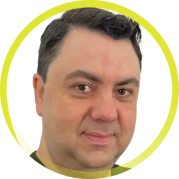

# 2025 OpenTelemetry Governance Committee Candidates

## List of candidates

In alphabetical order:

- [Antoine Toulme](#antoine-toulme)
- [Austin Parker](#austin-parker) 
- [Damien Mathieu](#damien-mathieu)
- [Juraci Paixão Kröhling](#juraci-paixão-kröhling)
- [Marylia Gutierrez](#marylia-gutierrez)
- [Severin Neumann](#severin-neumann)

---

### Antoine Toulme

- Company: [Splunk](https://www.splunk.com)
- GitHub: [atoulme](https://github.com/atoulme)

I'm Antoine Toulme, a long time open source enthusiast and product manager.
I have been involved in open source since 2007, with committer and advisory roles
under the Eclipse Foundation, the Apache Software Foundation and the Hyperledger
Foundation.

I have been active with OpenTelemetry since 2020 and am a maintainer of
OpenTelemetry Collector [Contrib](https://github.com/open-telemetry/opentelemetry-collector-contrib/#contributing),
and OpenTelemetry [Injector](https://github.com/open-telemetry/opentelemetry-injector),
approver of Collector [Core](https://github.com/open-telemetry/opentelemetry-collector/#contributing)
and [Operator](https://github.com/open-telemetry/opentelemetry-operator).

I sponsored approximately [39 components](https://github.com/open-telemetry/opentelemetry-collector-contrib/issues?q=is%3Aissue%20%20label%3A%22Accepted%20Component%22%20(commenter%3Aatoulme%20%22I%20can%20sponsor%22)%20OR%20(commenter%3Aatoulme%20%22I%20will%20sponsor%22)) 
and have authored many collector components, such as the Splunk HEC [receiver](https://github.com/open-telemetry/opentelemetry-collector-contrib/tree/main/receiver/splunkhecreceiver)
and [exporter](https://github.com/open-telemetry/opentelemetry-collector-contrib/tree/main/exporter/splunkhecexporter),
the [filestats](https://github.com/open-telemetry/opentelemetry-collector-contrib/tree/main/receiver/filestatsreceiver)
receiver, the [haproxy](https://github.com/open-telemetry/opentelemetry-collector-contrib/tree/main/receiver/haproxyreceiver)
receiver, the [otlpjsonfile](https://github.com/open-telemetry/opentelemetry-collector-contrib/tree/main/receiver/otlpjsonfilereceiver)
receiver.
I have pushed a lot of code, and I probably just broke the build again.

My goal is to make OpenTelemetry ubiquitous: easy to adopt and tempting with contribution opportunities.

You can see some of the effort through our work on enhancing the [OpenTelemetry Operator out-of-the-box experience](https://github.com/open-telemetry/opentelemetry-operator/pull/3830), 
or our work on the [Injector project](https://github.com/open-telemetry/opentelemetry-injector).

I have shown up on the project and helped push forward every day ([my activity on Collector contrib](https://github.com/open-telemetry/opentelemetry-collector-contrib/pulls?q=commenter%3Aatoulme)). 
I found this [piece by Rands](https://randsinrepose.com/archives/just-hard-work/) mirrors my experience, and makes me immensely proud.

I create automations that help the project scale, for example
[tagging first time contributions](https://github.com/open-telemetry/opentelemetry-collector-contrib/issues/41944)
so we can prioritize those first encounters. I also try to streamline manual reviews into automated checks, for example
by adding a [GitHub codeowners check](https://github.com/open-telemetry/opentelemetry-go-build-tools/tree/main/githubgen),
or a [Golang API checker](https://github.com/open-telemetry/opentelemetry-go-build-tools/tree/main/checkapi).

If elected, I intend to take my approach to help grow the project further: community first, innovating for impact, and process automation to scale.

You might see me poking fun around; I launched successfully https://ottl.fun as a conversation piece to the excellent https://ottl.run,
and I intend to run again this year my [OTel WareZ experiment](https://github.com/otel-warez).
Having fun and playing together is so important to me.

I hope to continue to be the ["worst player in the band"](https://www.goodreads.com/quotes/392893-always-be-the-worst-guy-in-every-band-you-re-in) - where you all play beautiful melodies, and I'm happy to be your roadie.

Thank you for your consideration and your support.

### Austin Parker

- Company: [honeycomb.io](https://honeycomb.io)
- GitHub: [austinlparker](https://github.com/austinlparker)

I'm Austin Parker, current Governance Committee member and long-time OpenTelemetry contributor. Since the earliest days of the project, I've been a consistent advocate for users, contributors, maintainers, and organizations adopting OpenTelemetry. Outside of OpenTelemetry, I'm Director of Open Source at honeycomb.io, a chair of Observability Day at KubeCon, and an author/speaker on OpenTelemetry and observability-related topics. Recently, like everyone else, I've been getting into AI! Neat stuff.

Over the past two years, I've been honored to serve this community as it continues to grow and mature. During that time, I've led several initiatives that I hope to continue -

- I've led the [OpenTelemetry Graduation](https://github.com/cncf/toc/issues/1739) initiative, which has included a wide variety of cross-functional tasks: helping to run our first [security audit](https://opentelemetry.io/blog/2024/security-audit-results/), working to improve our documentation and processes across the project, and much more.
- Along with other GC and TC members, I led the creation and bootstrapping of the Project Infrastructure SIG. This SIG is dedicated to handling cross-functional needs from our many sub-projects around tooling, GitHub management, cloud resources, etc. To date, we've launched several important projects to improve the security and reliability of builds and publishing, established complimentary cloud resources through Oracle Cloud for project use, and worked to get OpenTelmetry added to the Docker Sponsored Open Source program, unblocking our ability to publish to Docker Hub.
- With the CNCF, launched the first Open Source Observability Summit alongside a refreshed OTel Community Day in order to offer more platforms for our community to meet, interact, learn, and grow.
- Led the creation of the inaguaral [OpenTelemetry Community Stars](https://opentelemetry.io/blog/2024/community-awards/), an annual award designed to recognize the contributions of community members.

If elected, I plan to continue work on these important initiatives, and more. OpenTelemetry is an international community, and I pledge to bring more community events to regions outside North America, such as Europe and APAC. The strength of our project is in its people, and its maintainers, and I will continue to work to improve opportunities for developing the next generation of maintainers through mentoring programs and a renewed drive on supporting language communities (eg, working with language SIGs to bring OpenTelemetry into their language community through events, workshops, etc.) Finally, I believe it's important for us to renew our focus on developers. Generative AI promises to greatly expand the number of people who are creating, and running, code over the next five years. We need to provide a solid foundation of tooling, documentation, and extension points that allow for a delightful and 'AI-native' experience of using OpenTelemetry. If elected, I will dedicate time to supporting and contributing to projects such as local development tooling, AI native documentation, MCP servers for OpenTelemetry, and more.

Thank you for your vote. It is, truly, an honor to serve this community.

---

### Damien Mathieu

- Company: [Elastic](https://elastic.co)
- GitHub: [dmathieu](https://github.com/dmathieu)

Hi,

I'm Damien. I've been in the trenches of OpenTelemetry as a contributor and maintainer since 2019.

Over the past few years, I have been involved in several SIGs:

* I am a maintainer of the **Go SDK** SIG
* I am an approver for the **Collector**
* I am an approver for the **eBPF Profiler** SIG
* I am a member of the **Developer Experience** SIG
* I am a maintainer for the **French** localization

I believe OpenTelemetry is at a critical turning point. It's time to move from a tool for experts to a platform for everyone. If elected, my mission is singular: forge an unparalleled user experience.

Here is my pledge:

* **Solidify Our Foundation**: My top priority is to make participation in OpenTelemetry clear, fair, and rewarding. I will work with contributors, maintainers, and vendors to reduce friction in our processes, ensure recognition for all types of contributions, and keep engagement sustainable.
* **Ignite Ecosystem Innovation**: We must be more than a spec; we must be the epicenter of observability. I will champion collaborations with other projects and create fertile ground for radical experimentation, ensuring OpenTelemetry keeps leading the future.
* **Preserve and Evolve Our Foundations**: To support our future, we need governance processes that remain transparent, balanced, and adaptable. I will help refine and maintain the systems that already work well while ensuring they continue to scale with the growth of our community.

My deep involvement as a maintainer and contributor of many SIGs has given me the cross-project insight needed to make this vision a reality.

---

### Juraci Paixão Kröhling

- Company: [OllyGarden](https://ollygarden.com)
- GitHub: [jpkrohling](https://github.com/jpkrohling)

I'm Juraci Paixão Kröhling, and I'm running for my third term on the OpenTelemetry Governance Committee (GC). I've been serving on the GC since 2021, and during this time I've also transitioned to my own company, OllyGarden, where OpenTelemetry is at the center of our strategy.

From an engineering perspective, I created foundational tools that continue serving the community today, such as the OpenTelemetry Operator and the OpenTelemetry Collector Builder (ocb). I helped create key Collector features including the auth mechanism (creating the first auth extensions), the load balancing exporter, and maintained modules like the tail sampling processor for several years.

During my previous terms on the Governance Committee, I helped strengthen communication between the Governance and Technical Committees, mediated community conflicts, and coordinated OpenTelemetry's participation in Outreachy internship programs. I've facilitated significant donations such as Grafana Beyla (which became OpenTelemetry eBPF Instrumentation) and spoken at conferences worldwide. Since the beginning of this year, I'm focused on working directly with organizations to understand how they use OpenTelemetry in production and what challenges they face with telemetry quality and efficiency, bringing that knowledge back to the community.

My commitment to the project has also led me to start several side projects after talking to people who expressed specific community needs. I launched "Dose de Telemetria" to provide quality content in Portuguese, later expanded with "Telemetry Drops" for English-speaking audiences, and started the in-person OTel Night meetup in Berlin in response to the wish for local community gatherings.

If re-elected, my focus will be on telemetry quality: working with different stakeholders, including end-users, to improve the quality and efficiency of telemetry created with our diverse OpenTelemetry tools. Re-election would also give me renewed strength to continue my side-mission of creating quality content and organizing OTel Night.

---

### Marylia Gutierrez

- Company: [Grafana Labs](https://grafana.com)
- GitHub: [maryliag](https://github.com/maryliag)

I'm Marylia Gutierrez, a dedicated software engineer with a deep passion for open source and observability, backed by several years of hands-on experience in the industry. I currently contribute to OpenTelemetry as part of my role at Grafana Labs, providing me the focus and flexibility to dedicate substantial time and energy to the Governance Committee. 

I'm an active contributor on different projects:
- **Database Semantic Conventions (Approver)**: I was a core contributor to the stabilization of database semantic conventions, the second successful semantic convention stabilization in OTel
- **JavaScript SDK (Approver)**: I developed several features and improvements, including database stabilization, node runtime metrics, and most recently, declarative configuration. I also helped establish a process for reviewing old PRs, which reduced our open PRs to less than one page, improving the contributor experience
- **Contributor Experience (Maintainer)**: I work to improve the contributor experience, with items being done such as the creation and analysis of surveys on merged PRs to gather feedback, setting up a new `#opentelemetry-new-contributors` channel, and writing a blog post with guidance on [How to Contribute to OpenTelemetry](https://opentelemetry.io/blog/2025/contribute-to-otel/), as well as organizing action on the feedback received.
- **Portuguese Localization (Approver)**: I create content in Portuguese and am the top reviewer of PRs, making OpenTelemetry more accessible to Portuguese speakers.
- **Documentation (Triager)**: I assist with documentation in general.

My broad involvement across these areas enables me to bridge specification work, SDK implementation, and community health. This combination directly aligns with the Governance Committee's stewardship of both technical direction and project sustainability.

My passion for advocacy extends beyond code. I regularly create and share content about OpenTelemetry and Observability, in both English and Portuguese, through my personal [website](http://marylia.dev) and public talks (e.g. [KubeCon London](https://www.youtube.com/watch?v=Rf9NceXXRuw), [Humans of OTel interviews](https://www.youtube.com/watch?v=eZ3OrhxUAmU), [Humans of OTel Live at KubeCon](https://www.youtube.com/watch?v=EL0UkhvFAmY), [In Love with OTel Panel](https://www.youtube.com/watch?v=1CUMo-b50-Q), [LEAP 2.0 Panel](https://www.youtube.com/watch?v=738ZE05vt3w), [Observable Talk](https://www.youtube.com/watch?v=n0U4WMTWqbM&t=1330s), [CNCF Meetup Toronto](https://community.cncf.io/events/details/cncf-cloud-native-toronto-presents-october-toronto-cncf-meetup-end-user-stories/)). I also contribute to events, such as serving on the Open Source Summit Program Committee.

I have welcomed and mentored several newcomers to the area, including via [Outreachy internships](https://opentelemetry.io/blog/2025/outreachy-internship/), new joiners in Portuguese localization, and helping with the creation of the video [What is OTel?](https://www.youtube.com/watch?v=iEEIabOha8U), that has over 33k views. Through contributor-experience work, talks, panels and posts, I’ve focused on lowering the barrier to first contributions and improving newcomer journeys.

I bring a combination of perspectives to the Governance Committee: not only as a contributor to the OpenTelemetry project but also from my previous roles managing observability teams at Cockroach Labs and developing internal observability tools at IBM. These experiences have given me a rich understanding of the end-user journey with observability tools.

As a member of the Governance Committee, my focus will be to foster inclusivity and contributor success. My direct involvement with various SIGs will enable me to channel their needs and ensure that our contributor experience strategy remains focused on growing a diverse and engaged community. By joining the Governance Committee I will be in a unique position to amplify my advocacy efforts, driving strategic initiatives to expand our reach and directly influence the onboarding process for new contributors and users of OpenTelemetry, while keeping a good balance for existing approvers/maintainers.

I am committed to ensuring OpenTelemetry remains a thriving, inclusive project, and I believe my experience, leadership, and advocacy will help me contribute effectively to the Governance Committee’s mission.

OpenTelemetry's strength lies in its people. My candidacy reflects a vision where technical progress and community growth are inseparable. I would be honored to serve on the Governance Committee to continue advancing both.

Thank you for your support!

---

### Severin Neumann

- Company: [Causely](https://causely.ai)
- GitHub: [svrnm](https://github.com/svrnm)

Hi, I’m Severin Neumann, long-time OpenTelemetry contributor, maintainer of SIG Comms and SIG Contributor Experience, and current member of the Governance Committee. My focus has always been on building and sustaining the community, making OpenTelemetry approachable, visible, and healthy for contributors and adopters alike.

One of my proudest accomplishments in the past 12 months was launching and driving the localization project, enabling our docs and outreach to reach a global contributor base.

It has been a big honor and learning experience to be part of the Governance Committee for the last two years. [When I first ran](https://github.com/open-telemetry/community/blob/main/elections/2023/governance-committee-candidates.md#severin-neumann), I committed to strengthening contributor experience. Over the last term, I’ve delivered on that commitment by:

- [Establishing the SIG Check-in process](https://github.com/open-telemetry/community/blame/main/gc-check-ins.md), creating a regular, transparent feedback loop with all SIGs.
- [Founding the Contributor Experience SIG](https://github.com/open-telemetry/community/blob/main/projects/contributor-experience.md), which now plays a key role in onboarding and community health.
- Supporting project management to ensure initiatives are documented, tracked, and communicated.
- Handling conflict resolution and mediation, helping maintain a healthy and collaborative community environment.
- Contributing to the overall health of the community, from policies and processes to unblocking contributors.

If re-elected, I want to continue strengthening governance and contributor experience. In particular, I will:

- Focus on initiatives that lower barriers for new contributors and support existing contributors in their growth.
- Improve our project management and governance processes so the project can scale sustainably.
- Strengthen our relationships with other CNCF projects and the wider open source ecosystem, ensuring OpenTelemetry continues to thrive as a cornerstone project.

I’m grateful to everyone in the community for your trust and collaboration over the past two years. OpenTelemetry’s growth is only possible because of your efforts, and I’d be honored to continue serving as a Governance Committee member to help our community thrive.
