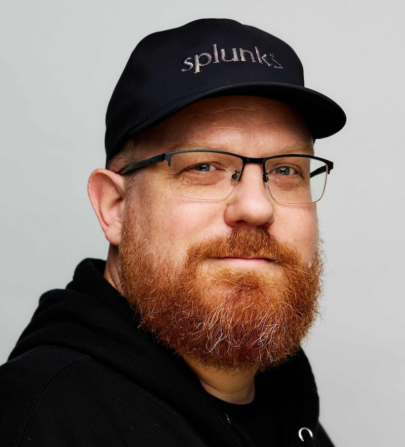

# 2026 OpenTelemetry Governance Committee Candidates

## List of candidates

In alphabetical order:

<!-- Add a link to each candidate's section here, e.g.: -->
<!-- - [Full Name](#full-name) -->
- [Antoine Toulme](#antoine-toulme)
- [Dan Gomez Blanco](#dan-gomez-blanco)
- [Josh Suereth](#josh-suereth)

---

### Antoine Toulme

- Company: [Splunk](https://www.splunk.com)
- GitHub: [atoulme](https://github.com/atoulme)

I am Antoine Toulme, active with OpenTelemetry since 2020 and a maintainer of
OpenTelemetry Collector [Contrib](https://github.com/open-telemetry/opentelemetry-collector-contrib/#contributing),
OpenTelemetry [Injector](https://github.com/open-telemetry/opentelemetry-injector),
OpenTelemetry [Packaging](https://github.com/open-telemetry/opentelemetry-packaging)
approver of Collector [Core](https://github.com/open-telemetry/opentelemetry-collector/#contributing)
and [Operator](https://github.com/open-telemetry/opentelemetry-operator).

If elected, my goal is to make OpenTelemetry ubiquitous:
* Easy to adopt, comes with batteries included. It's not enough to make great software, it should run on every device. OpenTelemetry deserves a first-class installation experience and to be included into every OS out there.
* Tempting with contribution opportunities, growing as a community of many practitioners. It has been an honor to help many users make their first commit with the project. I consider the number of new committers and approvers as the most critical health metric of the project.
* Powered by automation to scale processes and response time. OpenTelemetry is maturing as a critical infrastructure. The project has done a great job coordinating with GitHub actions and regular meetings. I expect we will see even more the need for managing our bureaucracy effectively, reviewing existing processes, adopting change and absorbing feedback.

I am working on this vision through the [OpenTelemetry Operator out-of-the-box experience](https://github.com/open-telemetry/opentelemetry-operator/pull/3830),
our work on the [injector project](https://github.com/open-telemetry/opentelemetry-injector), and the push for [better packaging](https://github.com/open-telemetry/opentelemetry-packaging).

I am an active committer ([my activity on Collector contrib](https://github.com/open-telemetry/opentelemetry-collector-contrib/pulls?q=commenter%3Aatoulme)), KubeCon speaker ([Injector talk](https://www.youtube.com/watch?v=t0gLrt2jZYs),
a [component and project sponsor](https://github.com/open-telemetry/opentelemetry-collector-contrib/issues?q=is%3Aissue%20%20label%3A%22Accepted%20Component%22%20(commenter%3Aatoulme%20%22I%20can%20sponsor%22)%20OR%20(commenter%3Aatoulme%20%22I%20will%20sponsor%22)).

---

### Dan Gomez Blanco

- Company: [New Relic](https://newrelic.com)
- GitHub: [danielgblanco](https://github.com/danielgblanco)

I'm Dan Gomez Blanco, OpenTelemetry contributor since 2021. Initially as an end user driving OTel adoption at scale within Skyscanner, maintainer of the End-User SIG since 2024, and past GC member from 2023 to 2025.

I've always been a public advocate for OTel best practice, not just for better observability, but to support the industry's shift towards platform engineering, since I believe OTel's success hinges on the sociotechnical aspects that make cross-cutting tooling easy to adopt into domain-specific logic. 
That focus led me to write _Practical OpenTelemetry_, to my current role driving OTel adoption with many more end users at even larger scale, and to recently launch the [OTel Blueprints and Reference Implementations](https://opentelemetry.io/blog/2026/blueprints-intro/) initiative within the End-User SIG.

As a past Governance Committee member, I focused on streamlining our [project lifecycle](https://github.com/open-telemetry/community/blob/main/project-management.md#project-lifecycle) and [roadmap management](https://github.com/open-telemetry/community/blob/main/roadmap-management.md) practices, improving clarity for [issue prioritization](https://opentelemetry.io/community/end-user/issue-participation/) with end users, and recognizing the community for their awesome work (co-leading the creation of [OpenTelemetry Live](https://community.cncf.io/opentelemetry-live/) and [Community Awards](https://opentelemetry.io/blog/2024/community-awards/)).

If elected, I want to evolve on that work and focus on:

- **Cross-SIG communication, anchored to adoption**, avoiding knowledge silos and making sure cross-cutting SIG work stays grounded in the challenges faced adopting OTel across multiple domains.
- **End-user prioritization**, giving end users a clear, actionable path to OTel architectures that solve real problems and deliver business outcomes, and making their feedback an actionable signal.
- **Roadmap clarity**, helping new and existing contributors align their work commitments with project priorities, and giving end users a more accurate view of where the project is headed.

Thank you for your consideration. I'd be honored to continue serving this community.

---

### Josh Suereth

- Company: [Google](https://google.com)
- GitHub: [jsuereth](https://github.com/jsuereth)

I'm Josh Suereth, a long-time OpenTelemetry contributor, Technical Committee Emeritus, and active maintainer across Semantic Conventions, Weaver, and project infrastructure. Since the early days of OpenTelemetry, I have worked across the specification, metrics, protocol, and semantic conventions. I've served as a sponsor and mentor for numerous SIGs including HTTP, CI/CD, System, Kubernetes, and Entities.

As OpenTelemetry continues to grow in scale and adoption, our greatest asset, and biggest challenge, is the health and sustainability of our community and maintainers. If elected to the Governance Committee, my primary focus will be on these three key issues:

- **Maintainer Sustainability & Tooling**: Maintainer burnout is real. Reducing maintainer toil and burnout through better automation, clearer project lifecycle management, and shared tooling (e.g. semantic-convention tooling like Weaver, automated governance checks, etc.) so maintainers can focus on high-impact work and building community.
- **Cross-SIG Innovation & Growth**: One thing I learned when sponsoring SIGs is that OpenTelemetry is a big space, with LOTS of smart individuals and great ideas. The challenge is that many SIGs are isolated from one another. OpenTelemetry grows because motivated individuals bring great ideas and are enabled and supported in the community, while adopting the core values of the project.
- **Refining our process**: OpenTelemetry's processes are well defined, but in a community of volunteers and with dramatic industry shifts, we need to constantly refine our processes to address these evolving needs and opportunities.

Thank you for your consideration and support!

<!--
Add a new candidate section below using the template:

### Full Name

- Company: [Company Name](https://example.com)
- GitHub: [handle](https://github.com/handle)

Short bio / reasoning to join the Governance Committee (no more than a short paragraph).
-->
