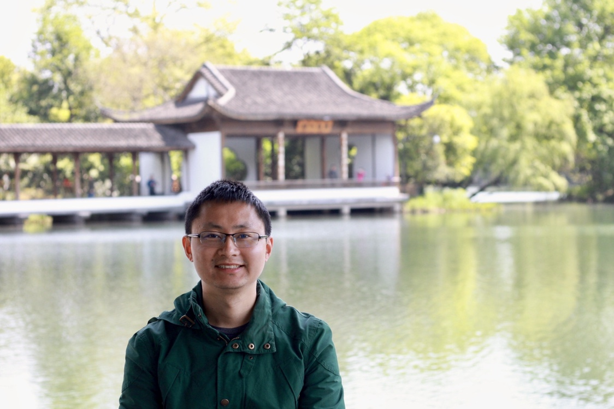
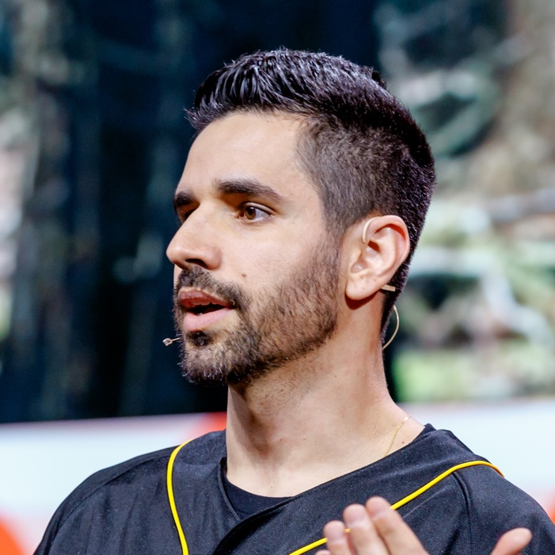
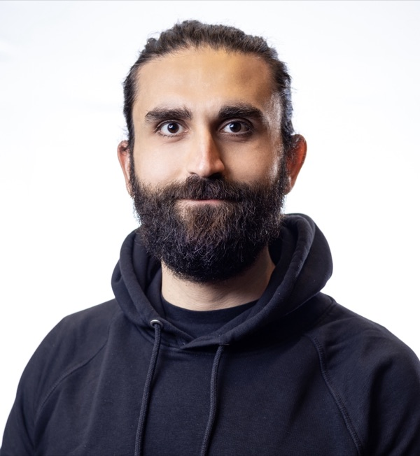

# 2026 OpenTelemetry Governance Committee Candidates

## List of candidates

In alphabetical order:

<!-- Add a link to each candidate's section here, e.g.: -->
<!-- - [Full Name](#full-name) -->
- [Antoine Toulme](#antoine-toulme)
- [Dan Gomez Blanco](#dan-gomez-blanco)
- [Huxing Zhang](#huxing-zhang)
- [Josh Suereth](#josh-suereth)
- [Juliano Costa](#juliano-costa)
- [Kemal Akkoyun](#kemal-akkoyun)
- [Pablo Baeyens Fernández](#pablo-baeyens-fernández)

---

### Antoine Toulme

- Company: [Splunk](https://www.splunk.com)
- GitHub: [atoulme](https://github.com/atoulme)

I am Antoine Toulme, active with OpenTelemetry since 2020 and a maintainer of
OpenTelemetry Collector [Contrib](https://github.com/open-telemetry/opentelemetry-collector-contrib/#contributing),
OpenTelemetry [Injector](https://github.com/open-telemetry/opentelemetry-injector),
OpenTelemetry [Packaging](https://github.com/open-telemetry/opentelemetry-packaging)
approver of Collector [Core](https://github.com/open-telemetry/opentelemetry-collector/#contributing)
and [Operator](https://github.com/open-telemetry/opentelemetry-operator).

If elected, my goal is to make OpenTelemetry ubiquitous:
* Easy to adopt, comes with batteries included. It's not enough to make great software, it should run on every device. OpenTelemetry deserves a first-class installation experience and to be included into every OS out there.
* Tempting with contribution opportunities, growing as a community of many practitioners. It has been an honor to help many users make their first commit with the project. I consider the number of new committers and approvers as the most critical health metric of the project.
* Powered by automation to scale processes and response time. OpenTelemetry is maturing as a critical infrastructure. The project has done a great job coordinating with GitHub actions and regular meetings. I expect we will see even more the need for managing our bureaucracy effectively, reviewing existing processes, adopting change and absorbing feedback.

I am working on this vision through the [OpenTelemetry Operator out-of-the-box experience](https://github.com/open-telemetry/opentelemetry-operator/pull/3830),
our work on the [injector project](https://github.com/open-telemetry/opentelemetry-injector), and the push for [better packaging](https://github.com/open-telemetry/opentelemetry-packaging).

I am an active committer ([my activity on Collector contrib](https://github.com/open-telemetry/opentelemetry-collector-contrib/pulls?q=commenter%3Aatoulme)), KubeCon speaker ([Injector talk](https://www.youtube.com/watch?v=t0gLrt2jZYs),
a [component and project sponsor](https://github.com/open-telemetry/opentelemetry-collector-contrib/issues?q=is%3Aissue%20%20label%3A%22Accepted%20Component%22%20(commenter%3Aatoulme%20%22I%20can%20sponsor%22)%20OR%20(commenter%3Aatoulme%20%22I%20will%20sponsor%22)).

---

### Dan Gomez Blanco

- Company: [New Relic](https://newrelic.com)
- GitHub: [danielgblanco](https://github.com/danielgblanco)

I'm Dan Gomez Blanco, OpenTelemetry contributor since 2021. Initially as an end user driving OTel adoption at scale within Skyscanner, maintainer of the End-User SIG since 2024, and past GC member from 2023 to 2025.

I've always been a public advocate for OTel best practice, not just for better observability, but to support the industry's shift towards platform engineering, since I believe OTel's success hinges on the sociotechnical aspects that make cross-cutting tooling easy to adopt into domain-specific logic. 
That focus led me to write _Practical OpenTelemetry_, to my current role driving OTel adoption with many more end users at even larger scale, and to recently launch the [OTel Blueprints and Reference Implementations](https://opentelemetry.io/blog/2026/blueprints-intro/) initiative within the End-User SIG.

As a past Governance Committee member, I focused on streamlining our [project lifecycle](https://github.com/open-telemetry/community/blob/main/project-management.md#project-lifecycle) and [roadmap management](https://github.com/open-telemetry/community/blob/main/roadmap-management.md) practices, improving clarity for [issue prioritization](https://opentelemetry.io/community/end-user/issue-participation/) with end users, and recognizing the community for their awesome work (co-leading the creation of [OpenTelemetry Live](https://community.cncf.io/opentelemetry-live/) and [Community Awards](https://opentelemetry.io/blog/2024/community-awards/)).

If elected, I want to evolve on that work and focus on:

- **Cross-SIG communication, anchored to adoption**, avoiding knowledge silos and making sure cross-cutting SIG work stays grounded in the challenges faced adopting OTel across multiple domains.
- **End-user prioritization**, giving end users a clear, actionable path to OTel architectures that solve real problems and deliver business outcomes, and making their feedback an actionable signal.
- **Roadmap clarity**, helping new and existing contributors align their work commitments with project priorities, and giving end users a more accurate view of where the project is headed.

Thank you for your consideration. I'd be honored to continue serving this community.

---

### Huxing Zhang

- Company: [Alibaba](https://www.alibabagroup.com/)
- GitHub: [ralf0131](https://github.com/ralf0131)

I'm Huxing Zhang, a Staff Engineer at Alibaba working on observability and a maintainer of the [OpenTelemetry Go Compile-Time Instrumentation SIG](https://github.com/open-telemetry/opentelemetry-go-compile-instrumentation#maintainers). I also lead open source efforts in Alibaba Cloud's cloud-native application department and serve as [Alibaba Cloud's alternate representative on the CNCF Governing Board](https://www.cncf.io/wp-content/uploads/2025/04/CNCF-Governing-Board-Meeting-Minutes-2025-03-12.pdf). I am an [Apache Software Foundation Member](https://people.apache.org/phonebook.html?uid=huxing) and a PMC member of [Apache Tomcat](https://tomcat.apache.org/whoweare.html) and [Apache Dubbo](https://people.apache.org/phonebook.html?uid=huxing). A central part of my work is bringing engineers into open source communities and helping them become sustained contributors.

At Alibaba, I have led and supported a team contributing across [OpenTelemetry Java instrumentation](https://github.com/open-telemetry/opentelemetry-java-instrumentation), [Go compile-time instrumentation](https://github.com/open-telemetry/opentelemetry-go-compile-instrumentation), [OpenTelemetry eBPF Instrumentation (OBI)](https://github.com/open-telemetry/opentelemetry-ebpf-instrumentation), [GenAI semantic conventions](https://github.com/open-telemetry/semantic-conventions-genai), and [GenAI instrumentation](https://github.com/open-telemetry/opentelemetry-python-genai). These are collective efforts, built through our engineers' work and collaboration with upstream communities. Examples include [MyBatis instrumentation](https://github.com/open-telemetry/opentelemetry-java-instrumentation/pull/10258), [JSON Schema definitions for GenAI tools](https://github.com/open-telemetry/semantic-conventions/pull/3378), [shared GenAI utilities for inference events and richer message types](https://github.com/open-telemetry/opentelemetry-python-contrib/pull/3994), and [Qwen-Agent instrumentation](https://github.com/open-telemetry/opentelemetry-python-genai/pull/310).

Our contributors have taken on long-term responsibilities: Steve Rao is a [Java instrumentation approver](https://github.com/open-telemetry/opentelemetry-java-instrumentation#approvers), Minghui Zhang is a [GenAI semantic conventions approver](https://github.com/open-telemetry/semantic-conventions-genai/blob/main/CONTRIBUTING.md#approvers), and Haibin Zhang is an [OBI approver](https://github.com/open-telemetry/opentelemetry-ebpf-instrumentation/blob/main/CONTRIBUTING.md#approvers). Helping engineers develop these relationships and earn the community's trust is an important part of my work.

I also led [Alibaba's Go compile-time instrumentation donation](https://github.com/open-telemetry/community/issues/2344) and worked with contributors from Datadog, Quesma, and the wider community to [establish a shared, vendor-neutral project](https://github.com/open-telemetry/community/pull/2490). This experience taught me how to turn a company's investment into a community effort with shared ownership.

Beyond engineering, I have [spoken at KubeCon](https://opentelemetry.io/blog/2024/kubecon-china/) and other community events, serve as a [lead organizer of KCD Hangzhou](https://www.cncf.io/wp-content/uploads/2026/01/KCD-Hangzhou-OID-China-2025-Transparency-Report.pdf), and actively [advocate for OpenTelemetry in China](https://observability.cn/article/ygg5p1i2sqkbgamq/). I also shared Alibaba's adoption experience through [OTel in Practice](https://opentelemetry.io/blog/2025/otip-alibaba/). These activities connect production users with contributors and help more people find their way into the community.

If elected, I would focus on three areas:

- **Make APAC adoption more visible and help it grow.** Through my work with companies in the region, I see OpenTelemetry adoption and production experience that rarely reach the wider community. I would help APAC companies, especially those in China, share case studies, challenges, and lessons through the [End-User SIG](https://opentelemetry.io/community/end-user/), OTel in Practice, community blogs, and conference talks. This exchange can inform upstream work and help other organizations adopt OpenTelemetry.

- **Strengthen connections between APAC and the global community.** Building on my conference-organizing experience, I would work with local organizers, CNCF, and OpenTelemetry community members to support more observability and OpenTelemetry summits, meetups, and workshops in APAC. I would help lower time-zone and language barriers to participation and encourage contributions across code, documentation, localization, reviews, and community activities. Through mentoring and clearer contribution paths, I want to help people and companies in APAC build lasting relationships with SIGs and take on long-term maintenance responsibilities.

- **Advance open standards for AI observability.** Building on our team's contributions to GenAI semantic conventions and instrumentation, I would support the relevant SIGs and [Technical Committee](https://github.com/open-telemetry/community/blob/main/tech-committee-charter.md) in advancing vendor-neutral observability standards for AI agents, model training, and inference. I would encourage closer integration between observability and evaluation, so that teams can connect system behavior, performance, and cost with assessments of AI quality and reliability. I would also help strengthen collaboration between OpenTelemetry and the Agentic AI Foundation (AAIF), particularly its [Observability & Traceability Working Group](https://aaif.io/working-groups/observability-traceability), by connecting contributors, sharing production use cases, and supporting joint discussions on semantic conventions and interoperability. My goal is to help these communities build on each other's work and reduce fragmentation across the AI ecosystem.

I would bring my experience in Apache governance, building contribution teams, and cross-company collaboration to the Governance Committee. My goal is to help OpenTelemetry grow as a globally connected, vendor-neutral community where users can share their experience and contributors can grow into trusted stewards.

Thank you for your consideration.

---

### Josh Suereth

- Company: [Google](https://google.com)
- GitHub: [jsuereth](https://github.com/jsuereth)

I'm Josh Suereth, a long-time OpenTelemetry contributor, Technical Committee Emeritus, and active maintainer across Semantic Conventions, Weaver, and project infrastructure. Since the early days of OpenTelemetry, I have worked across the specification, metrics, protocol, and semantic conventions. I've served as a sponsor and mentor for numerous SIGs including HTTP, CI/CD, System, Kubernetes, and Entities.

As OpenTelemetry continues to grow in scale and adoption, our greatest asset, and biggest challenge, is the health and sustainability of our community and maintainers. If elected to the Governance Committee, my primary focus will be on these three key issues:

- **Maintainer Sustainability & Tooling**: Maintainer burnout is real. Reducing maintainer toil and burnout through better automation, clearer project lifecycle management, and shared tooling (e.g. semantic-convention tooling like Weaver, automated governance checks, etc.) so maintainers can focus on high-impact work and building community.
- **Cross-SIG Innovation & Growth**: One thing I learned when sponsoring SIGs is that OpenTelemetry is a big space, with LOTS of smart individuals and great ideas. The challenge is that many SIGs are isolated from one another. OpenTelemetry grows because motivated individuals bring great ideas and are enabled and supported in the community, while adopting the core values of the project.
- **Refining our process**: OpenTelemetry's processes are well defined, but in a community of volunteers and with dramatic industry shifts, we need to constantly refine our processes to address these evolving needs and opportunities.

Thank you for your consideration and support!

---

### Juliano Costa

- Company: [Datadog](https://www.datadoghq.com/)
- GitHub: [julianocosta89](https://github.com/julianocosta89)

Hello there! I'm Juliano Costa. If you've ever deployed the OpenTelemetry Demo, there's a good chance we've already chatted. I've been contributing to OpenTelemetry since 2022, and today I'm an active maintainer on the [Demo](https://github.com/open-telemetry/opentelemetry-demo) and the [Developer Experience SIG](https://github.com/open-telemetry/sig-developer-experience), an approver on the [Helm Charts](https://github.com/open-telemetry/opentelemetry-helm-charts), and a regular contributor to our [docs](https://github.com/open-telemetry/opentelemetry.io). Across those repositories my contributions place me among the project's [top 30 contributors](https://insights.linuxfoundation.org/project/opentelemetry/contributors?timeRange=past365days&end=2026-10-02&start=2025-10-02) for the last year.

I'm also a CNCF Ambassador, helping spread the word about OpenTelemetry everywhere I go, speaking and running hands-on workshops at [KubeCon, Observability Summit, ContainerDays, SREday, DevOpsDays, KCDs/Cloud Native Days, and local meetups](https://sessionize.com/julianocosta89), in both English and Portuguese.

I like to call myself "OTel Customer Zero." The Demo is the one place in the project where every SDK, the Collector, the Helm charts, semantic conventions, and the docs all have to work together at once. We adopt new features before almost anyone outside the SIG that built them, we hit the rough edges first, and we carry that feedback back to the people who can fix it. That is the perspective I would bring to the Governance Committee: **a map of how the pieces fit together and where adoption actually breaks**. And because the Demo touches every part of the ecosystem, it is where many people make their very first OpenTelemetry contribution, and helping them land it well is some of the most rewarding work I do here.

If elected, I will focus on:

- **Making OpenTelemetry easier to adopt and use**, especially for end users, by driving the cross-SIG work that only shows up when you try to run the whole stack together.
- **Spreading our events across more of the world**, so that the chance to meet this community in person does not depend on which region you happen to live in.
- **Protecting maintainer time as contribution volume grows.** The Demo is a magnet for first-time and AI-generated pull requests, so I see this problem up close every week. I want to help us find practical approaches that keep the door open to genuine newcomers without burning out the people reviewing.

The other candidates are an outstanding group and I have learned a lot from each one of them. OpenTelemetry is a great project because of its community, and I would be honored to help steward it. Thank you for your consideration.

---

### Kemal Akkoyun

- Company: [Datadog](https://www.datadoghq.com/)
- GitHub: [kakkoyun](https://github.com/kakkoyun)

OpenTelemetry [graduated](https://opentelemetry.io/blog/2026/otel-graduates/) this year. SIGs run themselves, and much of the Governance Committee's work from here is helping them do that well: [checking in](https://github.com/open-telemetry/community/blob/main/gc-check-ins.md) on their health, reviewing and staffing [new projects](https://github.com/open-telemetry/community/blob/main/project-management.md), keeping contributor roles fair, and working with CNCF and neighboring projects. I already do parts of this work as a SIG lead, a mentor, and a member of the Prometheus Steering Committee, and I'd like to do more of it for OpenTelemetry.

I've worked on open source observability since 2019, mostly on Go, instrumentation, eBPF, and profiling. Much of that time went to the work that keeps a project healthy, like reviewing contributions and helping newcomers land their first change. I'm an emeritus maintainer of [Thanos](https://thanos.io/) and the [Prometheus Operator](https://prometheus-operator.dev/).

Prometheus is where I can add the most. I'm a maintainer in [Prometheus](https://prometheus.io/) and was elected to its [inaugural Steering Committee](https://github.com/prometheus/governance/blob/main/elections/2026/steering-committee-election.md#results) in June. The projects share many users and contributors, and when a question comes up that neither can settle alone, someone with standing in both can take it to the right people early. I want to be that bridge between the two communities, and to help OpenTelemetry's [Prometheus Interoperability](https://github.com/open-telemetry/community/blob/main/sigs.md#prometheus-interoperability) SIG where I can.

In OpenTelemetry I lead the [Go Compile-Time Instrumentation](https://github.com/open-telemetry/opentelemetry-go-compile-instrumentation) SIG. It [shipped v1](https://opentelemetry.io/blog/2026/go-compile-time-instrumentation-v1/) this summer and has maintainers from five organizations. I also helped bootstrap the [Zig SIG](https://github.com/open-telemetry/opentelemetry-zig). That work taught me to ask early whether a new SIG has enough maintainer time for the roadmap it proposes.

I've mentored through [LFX Mentorship](https://mentorship.lfx.linuxfoundation.org/) and [Google Summer of Code](https://summerofcode.withgoogle.com/) since 2020, for Thanos, Prometheus, and OpenTelemetry. This year I also mentored in the OpenTelemetry cohort of Bloomberg's [Sustaining Open Source](https://www.cncf.io/blog/2026/03/31/sustaining-opentelemetry-moving-from-dependency-management-to-stewardship/) program with CNCF. I [speak](https://kakkoyun.me/talks/) about instrumentation at KubeCon, FOSDEM, and other conferences. Seeing a mentee become a maintainer is still the best part of this work for me.

If elected, I would focus on:

- Prometheus and OpenTelemetry. I'd be a direct link between the two governing bodies on shared questions like contributor roles and mentorship. I'd do the same with Kubernetes, where I've taken part in [SIG Instrumentation](https://github.com/kubernetes/community/tree/master/sig-instrumentation).
- Healthy SIGs. I'd use SIG check-ins to ask where maintainers are stretched and follow up, with mentorship where it would help. I'd be a natural liaison for SIGs close to my own work, such as the [Go SIGs](https://github.com/open-telemetry/community/blob/main/sigs.md#golang-sdk), [Profiling](https://github.com/open-telemetry/community/blob/main/sigs.md#profiling), and [eBPF Instrumentation](https://github.com/open-telemetry/community/blob/main/sigs.md#ebpf-instrumentation).
- Responsible AI use. My SIG learned this the hard way when our monthly pull requests nearly quadrupled this summer and review could not keep up. I'd help make the project's [AI guidance](https://github.com/open-telemetry/community/blob/main/policies/genai.md) part of everyday practice across SIGs, so contributors know what good AI-assisted work looks like and maintainers have shared ways to manage the volume.

Thank you for considering me.

---

### Pablo Baeyens Fernández

- Company: [Datadog](https://www.datadoghq.com/)
- GitHub: [mx-psi](https://github.com/mx-psi)

I am Pablo Baeyens (mx-psi), current Governance Committee member. I have been an OpenTelemetry contributor since 2020, participating in semantic conventions, contributor experience, and the Collector, where I am a maintainer.

During my first term on the Governance Committee I worked on initiatives like:

- Dealing with LLM-related challenges: improving our [security model](https://github.com/open-telemetry/sig-security/pull/261), [GenAI usage policy](https://github.com/open-telemetry/community/pull/3283), and moderation efforts.
- Ensuring [transparency during the graduation process](https://cloud-native.slack.com/archives/C01NJ7V1KRC/p1760630847110029?thread_ts=1760025448.877589&cid=C01NJ7V1KRC) and [aligning the Collector SIG](https://github.com/open-telemetry/opentelemetry-collector/issues/14065) to show the CNCF that we were ready for graduation.
- [Sponsoring](https://github.com/open-telemetry/community/blob/main/projects/batching-config-standardization.md) [multiple](https://github.com/open-telemetry/community/blob/main/projects/agentic-workflow.md#gc-liaison) [projects](https://github.com/open-telemetry/community/blob/main/projects/policies.md), keeping our [processes](https://github.com/open-telemetry/community/pull/3538) and [tooling](https://github.com/open-telemetry/community/issues/3548) up to date, and making sure we leverage CNCF project opportunities and [collaborate with other CNCF projects](https://maintainersummiteu2026.sched.com/event/2EWep/project-meeting-prometheus-opentelemetry).

A few areas I would like to focus on in a second term are:

1. We are still figuring out how to deal with the impact of LLMs in our community, with community members now having to wear a moderator hat very often, and AI slop showing the weaknesses of our contributor workflows. There is a lot to improve on in terms of moderation policies and automation that I would like to make happen.
2. Maintainers deserve more transparency and more participation in project opportunities and decision-making bodies. I would like to include more parts of the community in KubeCon Maintainer Track talks, and allow maintainers to [have more of a voice in the TC selection process](https://github.com/open-telemetry/community/issues/3453).
3. We can and should automate more day-to-day duties and help follow best practices across all SIGs, introducing more shared workflows and improving Slack, project tracking, and SIG-specific automation.

Thank you for considering me!

<!--
Add a new candidate section below using the template:

### Full Name

- Company: [Company Name](https://example.com)
- GitHub: [handle](https://github.com/handle)

Short bio / reasoning to join the Governance Committee (no more than a short paragraph).
-->
