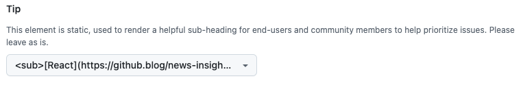

# Managing Popular GitHub Issues

Within OpenTelemetry, we encourage end-users and community members to leave 👍
reactions on GitHub issues they'd like to be worked on, as indicated in our
[website](https://opentelemetry.io/community/end-user/issue-participation/).
This can help maintainers to:

- Get a high-level signal that measures the interest from the community in
  particular issues, in a way that can be evaluated and compared across one or
  many repositories.
- Avoid redundant, unproductive comments like _"I have this issue too"_, which
  are difficult to compare across issues, and provide no context for triage.

In addition to these benefits, this standardized approach helps the wider
OpenTelemetry community by making it easier for end-users to highlight important
issues without requiring them to join SIG meetings or Slack channels. This also
allows the End-User SIG to focus on specific topics that demonstrate how user
input shapes OpenTelemetry, boosting engagement and strengthening the feedback
loop.

## Popularity Does Not Imply Priority

OpenTelemetry SIGs have the autonomy to organize their work and manage roadmaps
independently, balancing their priorities while remaining aligned with the
general direction of the project.

While maintainers may use these reactions to prioritize issues, they’re **not
expected to solely base their issue prioritization on popularity**. Cases where
popular issues are not prioritized include (but are not limited to):

* High-priority SIG work (e.g. security, spec compliance).
* Issues that require other work to be completed before they can be addressed.
* Requests or proposals not aligning with the direction of the project.

## Communicating Priorities

Triagers should keep the most voted issues up-to-date on a best-effort basis,
and communicate SIG priorities back to users if other work is taking precedence
before a given issue is prioritized. This avoids frustration for end-users and
gives them a way to see progress towards the issues they find the most
important.

How this communication is carried out within the most voted issues, or how many
issues are considered, is decided by SIG maintainers and triagers. This may 
involve pointing users to a project board where issues are prioritized, meeting
notes, or simply updating popular issues regularly.

## Finding the Most Popular Issues

The most popular issues for a given SIG can be found:

- For a particular repo: see
  [this sample filter](https://github.com/open-telemetry/community/issues?q=is%3Aissue+is%3Aopen+sort%3Areactions-%2B1-desc)
  for the `community` repo.
- Across multiple repos: see
  [this sample filter](https://github.com/search?q=is%3Aissue+is%3Aopen+sort%3Areactions-%2B1-desc+repo%3Aopen-telemetry%2Fopentelemetry.io+repo%3Aopen-telemetry%2Fcommunity+&type=issues)
  for the `community` and `opentelemetry.io` repos.

## Recommended Footnote on Issue Templates

We recommend using the following footnote on issue templates to ensure users
have direct access to guidance on how OpenTelemetry uses issue reactions.

### Markdown Templates

Add this to the bottom of the `.md` file. 

```markdown
<sub>**Tip**: [React](https://github.blog/news-insights/product-news/add-reactions-to-pull-requests-issues-and-comments/) with 👍 to help prioritize this issue. Please use comments to provide useful context, avoiding `+1` or `me too`, to help us triage it. Learn more [here](https://opentelemetry.io/community/end-user/issue-participation/).</sub>
```

Which renders as:

<sub>**Tip**: [React](https://github.blog/news-insights/product-news/add-reactions-to-pull-requests-issues-and-comments/) with 👍 to help prioritize this issue. Please use comments to provide useful context, avoiding `+1` or `me too`, to help us triage it. Learn more [here](https://opentelemetry.io/community/end-user/issue-participation/).</sub>

### Issue Forms

As covered in this
[feedback discussion topic](https://github.com/orgs/community/discussions/63402#discussioncomment-10341167),
it is not possible to create `markdown` elements that render on the resulting
issue body. As such, we recommend using a dropdown element with a default
option.

```yaml
  - type: dropdown
    attributes:
      label: Tip
      description: This element is static, used to render a helpful sub-heading for end-users and community members to help prioritize issues. Please leave as is.
      options:
        - <sub>[React](https://github.blog/news-insights/product-news/add-reactions-to-pull-requests-issues-and-comments/) with 👍 to help prioritize this issue. Please use comments to provide useful context, avoiding `+1` or `me too`, to help us triage it. Learn more [here](https://opentelemetry.io/community/end-user/issue-participation/).</sub>
      default: 0
```

In the issue form, this renders as:



In the resulting issue, this renders as:

### Tip

<sub>[React](https://github.blog/news-insights/product-news/add-reactions-to-pull-requests-issues-and-comments/)with 👍 to help prioritize this issue. Please use comments to provide useful context, avoiding `+1` or `me too`, to help us triage it. Learn more [here](https://opentelemetry.io/community/end-user/issue-participation/).</sub>
