# Workstream Report

## Workstream Hierarchy

```mermaid
%%{init: {"flowchart": {"nodeSpacing": 20, "rankSpacing": 40}}}%%
graph LR

  classDef tc_leading fill:#c8e6c9,stroke:#388e3c,color:#1b5e20
  classDef tc_guiding fill:#bbdefb,stroke:#1976d2,color:#0d47a1
  classDef tc_escalating fill:#e1bee7,stroke:#7b1fa2,color:#4a148c
  classDef tc_tbd fill:#f5f5f5,stroke:#9e9e9e,color:#424242
  classDef tc_none fill:#ffcdd2,stroke:#e53935,color:#b71c1c

  spec_general["Specification: General + OTel Maintainers Sync<br/>Kind: sig (spec)"]
  spec_general --> sampling
  sampling["Specification: Sampling<br/>Kind: sig (spec)<br/>GC: Juraci Paixão Kröhling<br/>TC: Josh MacDonald (guiding)"]
  spec_general --> spec_logs
  spec_logs["Specification: Logs<br/>Kind: sig (spec)<br/>GC: Trask Stalnaker<br/>TC: Liudmila Molkova (guiding)"]
  spec_general --> semconv_general
  semconv_general["Semantic Conventions: General<br/>Kind: sig (spec)<br/>GC: Trask Stalnaker<br/>TC: Armin Ruech (leading), Josh Suereth (leading), Liudmila Molkova (leading)"]
  semconv_general --> semconv_system_metrics
  semconv_system_metrics["Semantic Conventions: System Metrics<br/>Kind: sig (spec)<br/>GC: Pablo Baeyens<br/>TC: Josh Suereth (escalating)"]
  semconv_general --> semconv_k8s
  semconv_k8s["Semantic Conventions: K8s<br/>Kind: sig (spec)<br/>GC: Alolita Sharma<br/>TC: David Ashpole (leading)"]
  semconv_general --> gen_ai
  gen_ai["Semantic Conventions and Instrumentation: GenAI<br/>Kind: sig (spec)<br/>GC: Ted Young<br/>TC: Liudmila Molkova (leading)"]
  semconv_general --> semconv_cicd
  semconv_cicd["Semantic Conventions: CI/CD<br/>Kind: sig (spec)<br/>GC: Marylia Gutierrez<br/>TC: Carlos Alberto (escalating)"]
  semconv_cicd --> cicd_phase_2
  cicd_phase_2["CI/CD Observability SIG Phase 2<br/>Kind: working-group<br/>GC: Marylia Gutierrez<br/>TC: Carlos Alberto (tbd)"]
  semconv_general --> semconv_rpc
  semconv_rpc["Semantic Conventions: RPC<br/>Kind: sig (spec)<br/>GC: Trask Stalnaker<br/>TC: Liudmila Molkova (guiding)"]
  semconv_general --> semconv_security
  semconv_security["Semantic Conventions: Security<br/>Kind: sig (spec)<br/>GC: Trask Stalnaker<br/>TC: Josh Suereth (escalating)"]
  semconv_general --> semconv_service_deployment
  semconv_service_deployment["Semantic Conventions: Service and Deployment<br/>Kind: sig (spec)<br/>GC: Trask Stalnaker<br/>TC: Josh Suereth (tbd)"]
  semconv_general --> semconv_tooling
  semconv_tooling["Semantic Conventions: Tooling<br/>Kind: sig (impl)<br/>GC: Juraci Paixão Kröhling<br/>TC: Josh Suereth (leading), Liudmila Molkova (leading)"]
  spec_general --> spec_entities
  spec_entities["Specification: Entities<br/>Kind: sig (spec)<br/>GC: Severin Neumann<br/>TC: Josh Suereth (leading), Tigran Najaryan (leading)"]
  opamp["OpAMP<br/>Kind: sig (spec)<br/>GC: Ted Young<br/>TC: Tigran Najaryan (leading)"]
  prometheus_interop["Prometheus Interoperability<br/>Kind: sig (spec)<br/>GC: Pablo Baeyens<br/>TC: David Ashpole (leading)"]
  faas["Functions as a Service (FAAS)<br/>Kind: sig (spec)<br/>GC: Austin Parker"]
  profiling["Profiling<br/>Kind: sig (spec)<br/>GC: Morgan McLean<br/>TC: Josh Suereth (guiding), Tigran Najaryan (guiding)"]
  mainframes["OpenTelemetry on Mainframes<br/>Kind: sig (spec)<br/>GC: Morgan McLean"]
  client_instrumentation["Client Instrumentation<br/>Kind: sig (spec)<br/>GC: Ted Young<br/>TC: Carlos Alberto (escalating)"]
  android["Android: SDK + Automatic Instrumentation<br/>Kind: sig (impl)<br/>GC: Ted Young<br/>TC: Jack Berg (tbd)"]
  arrow["Arrow<br/>Kind: sig (impl)<br/>GC: Trask Stalnaker<br/>TC: Josh MacDonald (leading)"]
  browser["Browser<br/>Kind: sig (impl)<br/>GC: Ted Young<br/>TC: Carlos Alberto (tbd)"]
  collector["Collector<br/>Kind: sig (impl)<br/>GC: Pablo Baeyens<br/>TC: Bogdan Drutu (guiding), Josh MacDonald (guiding)"]
  collector --> agentic_workflow
  agentic_workflow["OpenTelemetry Collector Agentic Workflows<br/>Kind: working-group<br/>GC: Pablo Baeyens"]
  collector --> collector_v1
  collector_v1["Collector v1<br/>Kind: working-group<br/>GC: Juraci Paixão Kröhling"]
  cpp["C++: SDK<br/>Kind: sig (impl)<br/>GC: Severin Neumann<br/>TC: Reiley Yang (escalating)"]
  dotnet_auto_instr[".NET: Automatic Instrumentation<br/>Kind: sig (impl)<br/>GC: Morgan McLean<br/>TC: Reiley Yang (escalating)"]
  dotnet[".NET: SDK<br/>Kind: sig (impl)<br/>GC: Morgan McLean<br/>TC: Reiley Yang (escalating)"]
  erlang_elixir["Erlang/Elixir: SDK<br/>Kind: sig (impl)<br/>GC: Austin Parker<br/>TC: Josh Suereth (tbd)"]
  go["GoLang: SDK<br/>Kind: sig (impl)<br/>GC: Marylia Gutierrez<br/>TC: David Ashpole (leading)"]
  go_auto_instr["GoLang: Automatic Instrumentation<br/>Kind: sig (impl)<br/>GC: Juraci Paixão Kröhling<br/>TC: David Ashpole (escalating)"]
  go_compile_instr["GoLang: Compile-Time Instrumentation<br/>Kind: sig (impl)<br/>GC: Juraci Paixão Kröhling<br/>TC: David Ashpole (escalating)"]
  injector["Injector<br/>Kind: sig (impl)<br/>GC: Morgan McLean"]
  java_sdk_instrumentation["Java: SDK + Instrumentation<br/>Kind: sig (impl)<br/>GC: Trask Stalnaker<br/>TC: Jack Berg (leading)"]
  javascript_sdk["JavaScript: SDK<br/>Kind: sig (impl)<br/>GC: Marylia Gutierrez<br/>TC: Carlos Alberto (tbd)"]
  php_sdk["PHP: SDK<br/>Kind: sig (impl)<br/>GC: Severin Neumann<br/>TC: Jack Berg (tbd)"]
  python_sdk["Python: SDK<br/>Kind: sig (impl)<br/>GC: Marylia Gutierrez<br/>TC: Reiley Yang (tbd)"]
  ruby_sdk["Ruby: SDK<br/>Kind: sig (impl)<br/>GC: Ted Young<br/>TC: Armin Ruech (tbd)"]
  rust_sdk["Rust: SDK<br/>Kind: sig (impl)<br/>GC: Ted Young<br/>TC: Reiley Yang (escalating)"]
  swift_sdk["Swift: SDK<br/>Kind: sig (impl)<br/>GC: Alolita Sharma<br/>TC: Reiley Yang (tbd)"]
  network["Network<br/>Kind: sig (impl)<br/>GC: Ted Young<br/>TC: David Ashpole (escalating)"]
  ebpf_instrumentation["eBPF Instrumentation<br/>Kind: sig (impl)<br/>GC: Severin Neumann<br/>TC: David Ashpole (escalating)"]
  k8s_operator["Kubernetes Operator<br/>Kind: sig (impl)<br/>GC: Juraci Paixão Kröhling<br/>TC: David Ashpole (escalating)"]
  k8s_helm_charts["Kubernetes Helm Charts<br/>Kind: sig (impl)<br/>GC: Pablo Baeyens"]
  community_demo["Community Demo Application<br/>Kind: sig (impl)<br/>GC: Austin Parker<br/>TC: Reiley Yang (escalating)"]
  communications["Communications (Website, Documentation, etc.)<br/>Kind: sig (cross)<br/>GC: Severin Neumann<br/>TC: Jack Berg (tbd)"]
  communications --> localization_bn
  localization_bn["Bengali (bn)<br/>Kind: sig (cross)<br/>GC: Severin Neumann"]
  communications --> localization_zh_cn
  localization_zh_cn["Chinese (zh-CN)<br/>Kind: sig (cross)<br/>GC: Severin Neumann<br/>TC: Reiley Yang (tbd)"]
  communications --> localization_fr
  localization_fr["French (fr-FR)<br/>Kind: sig (cross)<br/>GC: Severin Neumann"]
  communications --> localization_ja
  localization_ja["Japanese (ja-JA)<br/>Kind: sig (cross)<br/>GC: Severin Neumann"]
  communications --> localization_pt_br
  localization_pt_br["Portuguese (pt-BR)<br/>Kind: sig (cross)<br/>GC: Severin Neumann"]
  communications --> localization_es
  localization_es["Spanish (es-ES)<br/>Kind: sig (cross)<br/>GC: Severin Neumann"]
  communications --> localization_uk
  localization_uk["Ukrainian (uk-UA)<br/>Kind: sig (cross)<br/>GC: Severin Neumann"]
  communications --> localization_ro
  localization_ro["Romanian (ro-RO)<br/>Kind: sig (cross)<br/>GC: Severin Neumann"]
  communications --> ecosystem_explorer
  ecosystem_explorer["OpenTelemetry Ecosystem Explorer<br/>Kind: working-group<br/>GC: Severin Neumann<br/>TC: Jack Berg (tbd)"]
  communications --> getting_started_docs
  getting_started_docs["New Getting Started Documentation and Reference Application<br/>Kind: working-group<br/>GC: Severin Neumann<br/>TC: Jack Berg (tbd)"]
  end_user["End-User SIG<br/>Kind: sig (cross)<br/>GC: Marylia Gutierrez<br/>TC: Jack Berg (tbd)"]
  end_user --> otel_blueprints
  otel_blueprints["OTel Blueprints<br/>Kind: working-group<br/>GC: Marylia Gutierrez<br/>TC: Reiley Yang (tbd)"]
  security["Security<br/>Kind: sig (cross)<br/>GC: Trask Stalnaker<br/>TC: Reiley Yang (leading)"]
  project_infra["Project Infrastructure<br/>Kind: sig (cross)<br/>GC: Austin Parker<br/>TC: Armin Ruech (tbd)"]
  contributor_experience["Contributor Experience<br/>Kind: sig (cross)<br/>GC: Marylia Gutierrez<br/>TC: Liudmila Molkova (escalating)"]
  developer_experience["Developer Experience<br/>Kind: sig (cross)<br/>GC: Austin Parker<br/>TC: Liudmila Molkova (escalating)"]
  zig_sig_bootstrap["Bootstrap Zig Special Interest Group<br/>Kind: working-group<br/>GC: Alolita Sharma<br/>TC: Josh MacDonald (tbd)"]

  class spec_general tc_none
  class sampling tc_guiding
  class spec_logs tc_guiding
  class semconv_general tc_leading
  class semconv_system_metrics tc_escalating
  class semconv_k8s tc_leading
  class gen_ai tc_leading
  class semconv_cicd tc_escalating
  class cicd_phase_2 tc_tbd
  class semconv_rpc tc_guiding
  class semconv_security tc_escalating
  class semconv_service_deployment tc_tbd
  class semconv_tooling tc_leading
  class spec_entities tc_leading
  class opamp tc_leading
  class prometheus_interop tc_leading
  class faas tc_none
  class profiling tc_guiding
  class mainframes tc_none
  class client_instrumentation tc_escalating
  class android tc_tbd
  class arrow tc_leading
  class browser tc_tbd
  class collector tc_guiding
  class agentic_workflow tc_none
  class collector_v1 tc_none
  class cpp tc_escalating
  class dotnet_auto_instr tc_escalating
  class dotnet tc_escalating
  class erlang_elixir tc_tbd
  class go tc_leading
  class go_auto_instr tc_escalating
  class go_compile_instr tc_escalating
  class injector tc_none
  class java_sdk_instrumentation tc_leading
  class javascript_sdk tc_tbd
  class php_sdk tc_tbd
  class python_sdk tc_tbd
  class ruby_sdk tc_tbd
  class rust_sdk tc_escalating
  class swift_sdk tc_tbd
  class network tc_escalating
  class ebpf_instrumentation tc_escalating
  class k8s_operator tc_escalating
  class k8s_helm_charts tc_none
  class community_demo tc_escalating
  class communications tc_tbd
  class localization_bn tc_none
  class localization_zh_cn tc_tbd
  class localization_fr tc_none
  class localization_ja tc_none
  class localization_pt_br tc_none
  class localization_es tc_none
  class localization_uk tc_none
  class localization_ro tc_none
  class ecosystem_explorer tc_tbd
  class getting_started_docs tc_tbd
  class end_user tc_tbd
  class otel_blueprints tc_tbd
  class security tc_leading
  class project_infra tc_tbd
  class contributor_experience tc_escalating
  class developer_experience tc_escalating
  class zig_sig_bootstrap tc_tbd

```

## Sponsorship Gaps

Workstreams with no assigned TC sponsor (**Unsponsored**) or with a sponsor whose level has not yet been determined (**Level TBD**).

| Workstream | Kind | Category | TC Status |
|------------|------|----------|-----------|
| Bengali (bn) | sig | cross | Unsponsored |
| Collector v1 | working-group | (child of Collector) | Unsponsored |
| French (fr-FR) | sig | cross | Unsponsored |
| Functions as a Service (FAAS) | sig | spec | Unsponsored |
| Injector | sig | impl | Unsponsored |
| Japanese (ja-JA) | sig | cross | Unsponsored |
| Kubernetes Helm Charts | sig | impl | Unsponsored |
| OpenTelemetry Collector Agentic Workflows | working-group | (child of Collector) | Unsponsored |
| OpenTelemetry on Mainframes | sig | spec | Unsponsored |
| Portuguese (pt-BR) | sig | cross | Unsponsored |
| Romanian (ro-RO) | sig | cross | Unsponsored |
| Spanish (es-ES) | sig | cross | Unsponsored |
| Specification: General + OTel Maintainers Sync | sig | spec | Unsponsored |
| Ukrainian (uk-UA) | sig | cross | Unsponsored |
| Android: SDK + Automatic Instrumentation | sig | impl | Level TBD |
| Bootstrap Zig Special Interest Group | working-group |  | Level TBD |
| Browser | sig | impl | Level TBD |
| CI/CD Observability SIG Phase 2 | working-group | (child of Semantic Conventions: CI/CD) | Level TBD |
| Chinese (zh-CN) | sig | cross | Level TBD |
| Communications (Website, Documentation, etc.) | sig | cross | Level TBD |
| End-User SIG | sig | cross | Level TBD |
| Erlang/Elixir: SDK | sig | impl | Level TBD |
| JavaScript: SDK | sig | impl | Level TBD |
| New Getting Started Documentation and Reference Application | working-group | (child of Communications (Website, Documentation, etc.)) | Level TBD |
| OTel Blueprints | working-group | (child of End-User SIG) | Level TBD |
| OpenTelemetry Ecosystem Explorer | working-group | (child of Communications (Website, Documentation, etc.)) | Level TBD |
| PHP: SDK | sig | impl | Level TBD |
| Project Infrastructure | sig | cross | Level TBD |
| Python: SDK | sig | impl | Level TBD |
| Ruby: SDK | sig | impl | Level TBD |
| Semantic Conventions: Service and Deployment | sig | spec | Level TBD |
| Swift: SDK | sig | impl | Level TBD |

_14 unsponsored, 18 level TBD_

## Community Member Coverage

### Technical Committee

| Member | TC: leading | TC: guiding | TC: escalating | TC: tbd |
|--------|-----------|-----------|-----------|-----------|
| [Carlos Alberto](https://github.com/carlosalberto) |  |  | Client Instrumentation, Semantic Conventions: CI/CD | Browser, JavaScript: SDK |
| [David Ashpole](https://github.com/dashpole) | GoLang: SDK, Prometheus Interoperability, Semantic Conventions: K8s |  | GoLang: Automatic Instrumentation, GoLang: Compile-Time Instrumentation, Kubernetes Operator, Network, eBPF Instrumentation |  |
| [Jack Berg](https://github.com/jack-berg) | Java: SDK + Instrumentation |  |  | Android: SDK + Automatic Instrumentation, Communications (Website, Documentation, etc.), End-User SIG, PHP: SDK |
| [Bogdan Drutu](https://github.com/BogdanDrutu) |  | Collector |  |  |
| [Josh MacDonald](https://github.com/jmacd) | Arrow | Collector, Specification: Sampling |  |  |
| [Liudmila Molkova](https://github.com/lmolkova) | Semantic Conventions and Instrumentation: GenAI, Semantic Conventions: General, Semantic Conventions: Tooling | Semantic Conventions: RPC, Specification: Logs | Contributor Experience, Developer Experience |  |
| [Tigran Najaryan](https://github.com/tigrannajaryan) | OpAMP, Specification: Entities | Profiling |  |  |
| [Armin Ruech](https://github.com/arminru) | Semantic Conventions: General |  |  | Project Infrastructure, Ruby: SDK |
| [Josh Suereth](https://github.com/jsuereth) | Semantic Conventions: General, Semantic Conventions: Tooling, Specification: Entities | Profiling | Semantic Conventions: Security, Semantic Conventions: System Metrics | Erlang/Elixir: SDK, Semantic Conventions: Service and Deployment |
| [Reiley Yang](https://github.com/reyang) | Security |  | .NET: Automatic Instrumentation, .NET: SDK, C++: SDK, Community Demo Application, Rust: SDK | Chinese (zh-CN), Python: SDK, Swift: SDK |
| **Total** | 15 | 7 | 16 | 13 |

### Governance Committee

| Member | GC Liaison |
|--------|-----------|
| [Pablo Baeyens](https://github.com/mx-psi) | Collector, Kubernetes Helm Charts, Prometheus Interoperability, Semantic Conventions: System Metrics |
| [Marylia Gutierrez](https://github.com/maryliag) | Contributor Experience, End-User SIG, GoLang: SDK, JavaScript: SDK, Python: SDK, Semantic Conventions: CI/CD |
| [Juraci Paixão Kröhling](https://github.com/jpkrohling) | GoLang: Automatic Instrumentation, GoLang: Compile-Time Instrumentation, Kubernetes Operator, Semantic Conventions: Tooling, Specification: Sampling |
| [Morgan McLean](https://github.com/mtwo) | .NET: Automatic Instrumentation, .NET: SDK, Injector, OpenTelemetry on Mainframes, Profiling |
| [Severin Neumann](https://github.com/svrnm) | Bengali (bn), C++: SDK, Chinese (zh-CN), Communications (Website, Documentation, etc.), French (fr-FR), Japanese (ja-JA), PHP: SDK, Portuguese (pt-BR), Romanian (ro-RO), Spanish (es-ES), Specification: Entities, Ukrainian (uk-UA), eBPF Instrumentation |
| [Austin Parker](https://github.com/austinlparker) | Community Demo Application, Developer Experience, Erlang/Elixir: SDK, Functions as a Service (FAAS), Project Infrastructure |
| [Alolita Sharma](https://github.com/alolita) | Semantic Conventions: K8s, Swift: SDK |
| [Trask Stalnaker](https://github.com/trask) | Arrow, Java: SDK + Instrumentation, Security, Semantic Conventions: General, Semantic Conventions: RPC, Semantic Conventions: Security, Semantic Conventions: Service and Deployment, Specification: Logs |
| [Ted Young](https://github.com/tedsuo) | Android: SDK + Automatic Instrumentation, Browser, Client Instrumentation, Network, OpAMP, Ruby: SDK, Rust: SDK, Semantic Conventions and Instrumentation: GenAI |

### Specification Sponsors

| Sponsor | Spec Sponsor |
|---------|-------------|
| [Marc Alff](https://github.com/marcalff) |  |
| [Alex Boten](https://github.com/codeboten) |  |
| [Leighton Chen](https://github.com/lzchen) |  |
| [Daniel Dyla](https://github.com/dyladan) | OpenTelemetry on Mainframes |
| [Juraci Paixão Kröhling](https://github.com/jpkrohling) |  |
| [Severin Neumann](https://github.com/svrnm) |  |
| [Christian Neumüller](https://github.com/Oberon00) |  |
| [Robert Pająk](https://github.com/pellared) |  |
| [Tristan Sloughter](https://github.com/tsloughter) |  |
| [Cijo Thomas](https://github.com/cijothomas) |  |
| [Tyler Yahn](https://github.com/MrAlias) |  |
| [Ted Young](https://github.com/tedsuo) | Semantic Conventions and Instrumentation: GenAI, Specification: Logs |
