# Workstream Report

## Legend

**Node color** — TC sponsorship level:

| Color | Level | Meaning |
|-------|-------|---------|
| Green | Leading | TC sponsor actively driving the workstream |
| Blue | Guiding | TC sponsor providing guidance |
| Purple | Escalating | TC sponsor available for escalation |
| Gray | TBD | Sponsor assigned, level not yet determined |
| Red | None | No TC sponsor assigned |

**Node shape** — workstream kind: rectangle = SIG · pill = Working Group

**Arrows** (`-->`) — parent workstream points to child workstream

**TC Coverage line** — `TC Coverage: L:x% (y%) · G:x% (y%) · E:x% (y%)` — share of all Leading / Guiding / Escalating sponsorships assigned to this workstream. Figure in parentheses rolls up all child workstreams; parentheses omitted when the workstream has no children contributing at that level. `tbd` when no sponsor is assigned.

## Workstream Hierarchy

```mermaid
%%{init: {"flowchart": {"nodeSpacing": 20, "rankSpacing": 40}}}%%
graph LR

  classDef tc_leading fill:#c8e6c9,stroke:#388e3c,color:#1b5e20
  classDef tc_guiding fill:#bbdefb,stroke:#1976d2,color:#0d47a1
  classDef tc_escalating fill:#e1bee7,stroke:#7b1fa2,color:#4a148c
  classDef tc_tbd fill:#f5f5f5,stroke:#9e9e9e,color:#424242
  classDef tc_none fill:#ffcdd2,stroke:#e53935,color:#b71c1c

  communications["Communications (Website, Documentation, etc.)<br/>GC: Severin Neumann<br/>TC: Jack Berg (E)<br/>TC Coverage: E:3% (7%)"]
  communications --> localization_bn
  localization_bn["Bengali (bn)<br/>GC: Severin Neumann<br/>TC: tbd<br/>TC Coverage: tbd"]
  communications --> localization_zh_cn
  localization_zh_cn["Chinese (zh-CN)<br/>GC: Severin Neumann<br/>TC: Reiley Yang (tbd)<br/>TC Coverage: tbd"]
  communications --> localization_fr
  localization_fr["French (fr-FR)<br/>GC: Severin Neumann<br/>TC: tbd<br/>TC Coverage: tbd"]
  communications --> localization_ja
  localization_ja["Japanese (ja-JA)<br/>GC: Severin Neumann<br/>TC: tbd<br/>TC Coverage: tbd"]
  communications --> getting_started_docs
  getting_started_docs(["New Getting Started Documentation and Reference Application<br/>GC: Severin Neumann<br/>TC: Jack Berg (tbd)<br/>TC Coverage: tbd"])
  communications --> ecosystem_explorer
  ecosystem_explorer(["OpenTelemetry Ecosystem Explorer<br/>GC: Severin Neumann<br/>TC: Jack Berg (E)<br/>TC Coverage: E:3%"])
  communications --> localization_pl
  localization_pl["Polish (pl-PL)<br/>GC: Severin Neumann<br/>TC: tbd<br/>TC Coverage: tbd"]
  communications --> localization_pt_br
  localization_pt_br["Portuguese (pt-BR)<br/>GC: Severin Neumann<br/>TC: tbd<br/>TC Coverage: tbd"]
  communications --> localization_ro
  localization_ro["Romanian (ro-RO)<br/>GC: Severin Neumann<br/>TC: tbd<br/>TC Coverage: tbd"]
  communications --> localization_es
  localization_es["Spanish (es-ES)<br/>GC: Severin Neumann<br/>TC: tbd<br/>TC Coverage: tbd"]
  communications --> localization_uk
  localization_uk["Ukrainian (uk-UA)<br/>GC: Severin Neumann<br/>TC: tbd<br/>TC Coverage: tbd"]
  spec_general["Specification: General + OTel Maintainers Sync<br/>TC: Armin Ruech (tbd), Bogdan Drutu (tbd), Carlos Alberto Cortez (tbd)<br/>David Ashpole (tbd), Jack Berg (tbd), Joshua MacDonald (tbd)<br/>Josh Suereth (tbd), Liudmila Molkova (tbd), Reiley Yang (tbd)<br/>Tigran Najaryan (tbd)<br/>TC Coverage: L:0% (60%) · G:0% (33%) · E:0% (13%)"]
  spec_general --> semconv_general
  semconv_general["Semantic Conventions: General<br/>GC: Trask Stalnaker<br/>TC: Armin Ruech (L), Josh Suereth (L), Liudmila Molkova (L)<br/>TC Coverage: L:20% (47%) · G:0% (11%) · E:0% (13%)"]
  semconv_general --> semconv_cicd
  semconv_cicd["Semantic Conventions: CI/CD<br/>GC: Marylia Gutierrez<br/>TC: Carlos Alberto Cortez (E)<br/>TC Coverage: E:3%"]
  semconv_cicd --> cicd_phase_2
  cicd_phase_2(["CI/CD Observability SIG Phase 2<br/>GC: Marylia Gutierrez<br/>TC: Carlos Alberto Cortez (tbd)<br/>TC Coverage: tbd"])
  semconv_general --> gen_ai
  gen_ai["Semantic Conventions and Instrumentation: GenAI<br/>GC: Ted Young<br/>TC: Liudmila Molkova (L)<br/>TC Coverage: L:7%"]
  semconv_general --> semconv_k8s
  semconv_k8s["Semantic Conventions: K8s<br/>GC: Alolita Sharma<br/>TC: David Ashpole (L)<br/>TC Coverage: L:7%"]
  semconv_general --> semconv_rpc
  semconv_rpc["Semantic Conventions: RPC<br/>GC: Trask Stalnaker<br/>TC: Liudmila Molkova (G)<br/>TC Coverage: G:11%"]
  semconv_general --> semconv_security
  semconv_security["Semantic Conventions: Security<br/>GC: Trask Stalnaker<br/>TC: Josh Suereth (E)<br/>TC Coverage: E:3%"]
  semconv_general --> semconv_service_deployment
  semconv_service_deployment["Semantic Conventions: Service and Deployment<br/>GC: Trask Stalnaker<br/>TC: Josh Suereth (E)<br/>TC Coverage: E:3%"]
  semconv_general --> semconv_system_metrics
  semconv_system_metrics["Semantic Conventions: System Metrics<br/>GC: Pablo Baeyens<br/>TC: Josh Suereth (E)<br/>TC Coverage: E:3%"]
  semconv_general --> semconv_tooling
  semconv_tooling["Semantic Conventions: Tooling<br/>GC: Juraci Paixão Kröhling<br/>TC: Josh Suereth (L), Liudmila Molkova (L)<br/>TC Coverage: L:13%"]
  spec_general --> spec_entities
  spec_entities["Specification: Entities<br/>GC: Severin Neumann<br/>TC: Josh Suereth (L), Tigran Najaryan (L)<br/>TC Coverage: L:13%"]
  spec_general --> spec_logs
  spec_logs["Specification: Logs<br/>GC: Trask Stalnaker<br/>TC: Liudmila Molkova (G)<br/>TC Coverage: G:11%"]
  spec_general --> sampling
  sampling["Specification: Sampling<br/>GC: Juraci Paixão Kröhling<br/>TC: Joshua MacDonald (G)<br/>TC Coverage: G:11%"]
  collector["Collector<br/>GC: Pablo Baeyens<br/>TC: BogdanDrutu (G), Joshua MacDonald (G)<br/>TC Coverage: G:22%"]
  collector --> collector_v1
  collector_v1(["Collector v1<br/>GC: Juraci Paixão Kröhling<br/>TC: tbd<br/>TC Coverage: tbd"])
  collector --> agentic_workflow
  agentic_workflow(["OpenTelemetry Collector Agentic Workflows<br/>GC: Pablo Baeyens<br/>TC: tbd<br/>TC Coverage: tbd"])
  end_user["End-User SIG<br/>GC: Marylia Gutierrez<br/>TC: Jack Berg (E)<br/>TC Coverage: E:3% (7%)"]
  end_user --> otel_blueprints
  otel_blueprints(["OTel Blueprints<br/>GC: Marylia Gutierrez<br/>TC: Reiley Yang (E)<br/>TC Coverage: E:3%"])
  dotnet_auto_instr[".NET: Automatic Instrumentation<br/>GC: Morgan McLean<br/>TC: Reiley Yang (E)<br/>TC Coverage: E:3%"]
  dotnet[".NET: SDK<br/>GC: Morgan McLean<br/>TC: Reiley Yang (E)<br/>TC Coverage: E:3%"]
  android["Android: SDK + Automatic Instrumentation<br/>GC: Ted Young<br/>TC: Jack Berg (E)<br/>TC Coverage: E:3%"]
  arrow["Arrow<br/>GC: Trask Stalnaker<br/>TC: Joshua MacDonald (L)<br/>TC Coverage: L:7%"]
  zig_sig_bootstrap(["Bootstrap Zig Special Interest Group<br/>GC: Alolita Sharma<br/>TC: Joshua MacDonald (tbd)<br/>TC Coverage: tbd"])
  browser["Browser<br/>GC: Ted Young<br/>TC: Carlos Alberto Cortez (E)<br/>TC Coverage: E:3%"]
  cpp["C++: SDK<br/>GC: Severin Neumann<br/>TC: Reiley Yang (E)<br/>TC Coverage: E:3%"]
  client_instrumentation["Client Instrumentation<br/>GC: Ted Young<br/>TC: Carlos Alberto Cortez (E)<br/>TC Coverage: E:3%"]
  community_demo["Community Demo Application<br/>GC: Austin Parker<br/>TC: Reiley Yang (E)<br/>TC Coverage: E:3%"]
  contributor_experience["Contributor Experience<br/>GC: Marylia Gutierrez<br/>TC: Liudmila Molkova (E)<br/>TC Coverage: E:3%"]
  developer_experience["Developer Experience<br/>GC: Austin Parker<br/>TC: Liudmila Molkova (E)<br/>TC Coverage: E:3%"]
  erlang_elixir["Erlang/Elixir: SDK<br/>GC: Austin Parker<br/>TC: Josh Suereth (E)<br/>TC Coverage: E:3%"]
  faas["Functions as a Service (FAAS)<br/>GC: Austin Parker<br/>TC: tbd<br/>TC Coverage: tbd"]
  go_auto_instr["GoLang: Automatic Instrumentation<br/>GC: Juraci Paixão Kröhling<br/>TC: David Ashpole (E)<br/>TC Coverage: E:3%"]
  go_compile_instr["GoLang: Compile-Time Instrumentation<br/>GC: Juraci Paixão Kröhling<br/>TC: David Ashpole (E)<br/>TC Coverage: E:3%"]
  go["GoLang: SDK<br/>GC: Marylia Gutierrez<br/>TC: David Ashpole (L)<br/>TC Coverage: L:7%"]
  injector["Injector<br/>GC: Morgan McLean<br/>TC: Jack Berg (G)<br/>TC Coverage: G:11%"]
  java_sdk_instrumentation["Java: SDK + Instrumentation<br/>GC: Trask Stalnaker<br/>TC: Jack Berg (L)<br/>TC Coverage: L:7%"]
  javascript_sdk["JavaScript: SDK<br/>GC: Marylia Gutierrez<br/>TC: Carlos Alberto Cortez (E)<br/>TC Coverage: E:3%"]
  kotlin["Kotlin: SDK<br/>GC: Alolita Sharma<br/>TC: Carlos Alberto Cortez (G)<br/>TC Coverage: G:11%"]
  k8s_helm_charts["Kubernetes Helm Charts<br/>GC: Pablo Baeyens<br/>TC: tbd<br/>TC Coverage: tbd"]
  k8s_operator["Kubernetes Operator<br/>GC: Juraci Paixão Kröhling<br/>TC: David Ashpole (E)<br/>TC Coverage: E:3%"]
  network["Network<br/>GC: Ted Young<br/>TC: David Ashpole (E)<br/>TC Coverage: E:3%"]
  opamp["OpAMP<br/>GC: Ted Young<br/>TC: Tigran Najaryan (L)<br/>TC Coverage: L:7%"]
  mainframes["OpenTelemetry on Mainframes<br/>GC: Morgan McLean<br/>TC: tbd<br/>TC Coverage: tbd"]
  php_sdk["PHP: SDK<br/>GC: Severin Neumann<br/>TC: Jack Berg (E)<br/>TC Coverage: E:3%"]
  profiling["Profiling<br/>GC: Morgan McLean<br/>TC: Josh Suereth (G), Tigran Najaryan (G)<br/>TC Coverage: G:22%"]
  project_infra["Project Infrastructure<br/>GC: Austin Parker<br/>TC: Armin Ruech (E)<br/>TC Coverage: E:3%"]
  prometheus_interop["Prometheus Interoperability<br/>GC: Pablo Baeyens<br/>TC: David Ashpole (L)<br/>TC Coverage: L:7%"]
  python_sdk["Python: SDK<br/>GC: Marylia Gutierrez<br/>TC: Reiley Yang (E)<br/>TC Coverage: E:3%"]
  ruby_sdk["Ruby: SDK<br/>GC: Ted Young<br/>TC: Armin Ruech (E)<br/>TC Coverage: E:3%"]
  rust_sdk["Rust: SDK<br/>GC: Ted Young<br/>TC: Reiley Yang (E)<br/>TC Coverage: E:3%"]
  security["Security<br/>GC: Trask Stalnaker<br/>TC: Reiley Yang (L)<br/>TC Coverage: L:7%"]
  swift_sdk["Swift: SDK<br/>GC: Alolita Sharma<br/>TC: Reiley Yang (E)<br/>TC Coverage: E:3%"]
  ebpf_instrumentation["eBPF Instrumentation<br/>GC: Severin Neumann<br/>TC: David Ashpole (E)<br/>TC Coverage: E:3%"]

  class communications tc_escalating
  class localization_bn tc_none
  class localization_zh_cn tc_tbd
  class localization_fr tc_none
  class localization_ja tc_none
  class getting_started_docs tc_tbd
  class ecosystem_explorer tc_escalating
  class localization_pl tc_none
  class localization_pt_br tc_none
  class localization_ro tc_none
  class localization_es tc_none
  class localization_uk tc_none
  class spec_general tc_tbd
  class semconv_general tc_leading
  class semconv_cicd tc_escalating
  class cicd_phase_2 tc_tbd
  class gen_ai tc_leading
  class semconv_k8s tc_leading
  class semconv_rpc tc_guiding
  class semconv_security tc_escalating
  class semconv_service_deployment tc_escalating
  class semconv_system_metrics tc_escalating
  class semconv_tooling tc_leading
  class spec_entities tc_leading
  class spec_logs tc_guiding
  class sampling tc_guiding
  class collector tc_guiding
  class collector_v1 tc_none
  class agentic_workflow tc_none
  class end_user tc_escalating
  class otel_blueprints tc_escalating
  class dotnet_auto_instr tc_escalating
  class dotnet tc_escalating
  class android tc_escalating
  class arrow tc_leading
  class zig_sig_bootstrap tc_tbd
  class browser tc_escalating
  class cpp tc_escalating
  class client_instrumentation tc_escalating
  class community_demo tc_escalating
  class contributor_experience tc_escalating
  class developer_experience tc_escalating
  class erlang_elixir tc_escalating
  class faas tc_none
  class go_auto_instr tc_escalating
  class go_compile_instr tc_escalating
  class go tc_leading
  class injector tc_guiding
  class java_sdk_instrumentation tc_leading
  class javascript_sdk tc_escalating
  class kotlin tc_guiding
  class k8s_helm_charts tc_none
  class k8s_operator tc_escalating
  class network tc_escalating
  class opamp tc_leading
  class mainframes tc_none
  class php_sdk tc_escalating
  class profiling tc_guiding
  class project_infra tc_escalating
  class prometheus_interop tc_leading
  class python_sdk tc_escalating
  class ruby_sdk tc_escalating
  class rust_sdk tc_escalating
  class security tc_leading
  class swift_sdk tc_escalating
  class ebpf_instrumentation tc_escalating

```

## TC Sponsorship Summary

| Member | Leading | Guiding | Escalating | Tbd | Total |
|--------|---------|---------|---------|---------|---------|
| [David Ashpole](https://github.com/dashpole) | 3 |  | 5 | 1 | 9 |
| [Jack Berg](https://github.com/jack-berg) | 1 | 1 | 5 | 2 | 9 |
| [Carlos Alberto Cortez](https://github.com/carlosalberto) |  | 1 | 4 | 2 | 7 |
| [Bogdan Drutu](https://github.com/bogdandrutu) |  | 1 |  | 1 | 2 |
| [Joshua MacDonald](https://github.com/jmacd) | 1 | 2 |  | 2 | 5 |
| [Liudmila Molkova](https://github.com/lmolkova) | 3 | 2 | 2 | 1 | 8 |
| [Tigran Najaryan](https://github.com/tigrannajaryan) | 2 | 1 |  | 1 | 4 |
| [Armin Ruech](https://github.com/arminru) | 1 |  | 2 | 1 | 4 |
| [Josh Suereth](https://github.com/jsuereth) | 3 | 1 | 4 | 1 | 9 |
| [Reiley Yang](https://github.com/reyang) | 1 |  | 8 | 2 | 11 |
| **Total** | 15 | 9 | 30 | 14 | 68 |

13 workstream(s) have no TC sponsor assigned.
